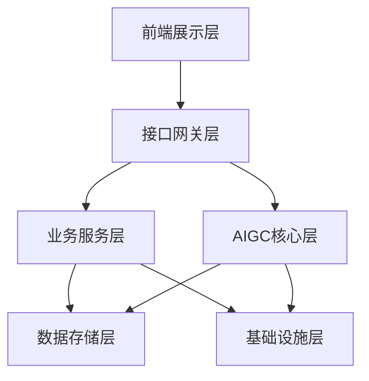
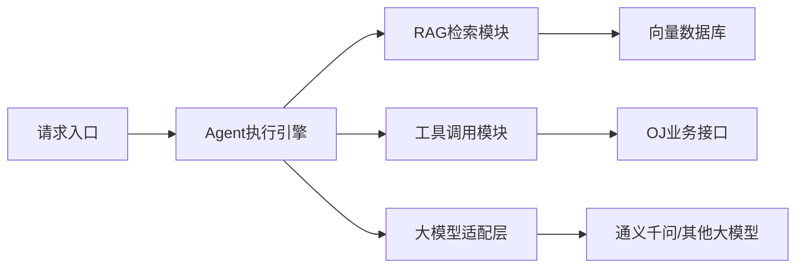
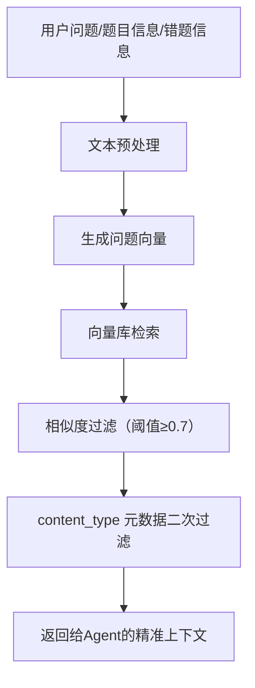
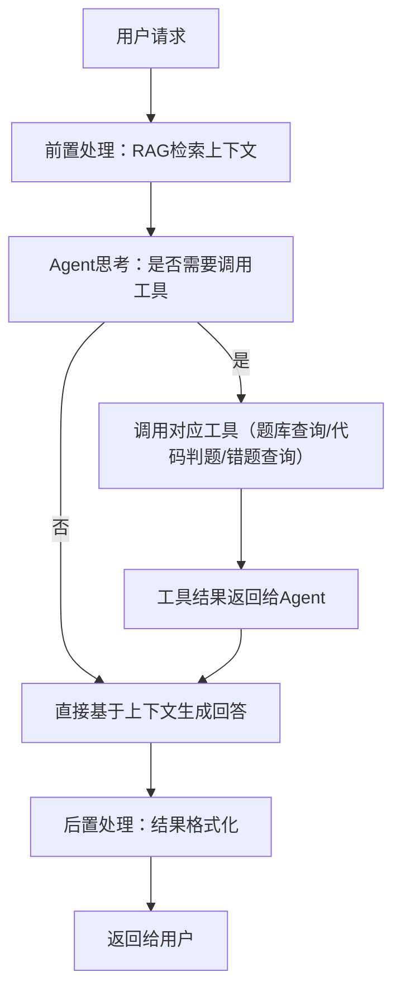
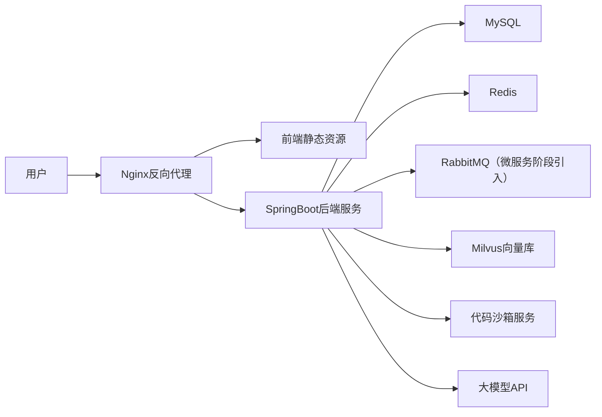

# XI OJ 平台AIGC能力整合与功能拓展设计
文档版本：V1.0
适用范围：IOJ平台现有项目二次开发、AIGC能力落地
更新日期：2026年03月

## 一、方案概述
### 1.1 项目背景
本方案基于现有XI OJ平台进行二次开发与优化，在保留原有核心判题、题库、用户体系的基础上，深度整合AIGC能力，解决用户编程学习中「错题无指导、解题无思路、学习无路径」的核心痛点，同时完善平台的用户管理、互动社区、个性化配置等基础功能，打造「练-评-学-练」闭环的智能化OJ学习平台。

### 1.2 核心目标
1. **落地AIGC核心能力**：基于LangChain4j实现RAG+Agent技术架构，完成AI代码分析、AI智能判题、AI问答助手、AI题目解析、相似题推荐、AI错题本六大核心AI功能；
2. **完善平台基础能力**：新增AI功能全局开关、用户信息管理、登录注册优化、题目评论区等功能，补齐平台产品能力；
3. **前端体验优化**：对齐现有AI分析、AI问答页面的交互逻辑，完成前端页面的统一优化与适配；
4. **可拓展架构设计**：实现业务层与AIGC层解耦，支持后续功能的快速迭代。

### 1.3 适配范围
- 完全兼容现有OJ平台的Java SpringBoot技术栈、MySQL数据库、代码沙箱判题体系；
- 完全适配「AI判题、AI助手自动回复、AI分析题目、AI分析提交代码、AI问答、AI开关、用户信息管理、评论区、AI错题本」的功能需求；
- 支持Java 8及以上版本，兼容LangChain4j全版本核心能力。

## 二、整体架构设计
本方案采用**分层解耦架构**，将AIGC能力作为独立的核心层封装，与现有业务系统完全解耦，既保证现有功能的稳定性，又支持后续能力的快速迭代。

### 2.1 整体架构图


### 2.2 分层职责说明
| 层级 | 核心模块 | 职责说明 |
|------|----------|----------|
| 前端展示层 | AI分析页面、AI问答页面、题目详情页、代码提交页、用户中心、评论区、错题本 | 负责用户交互与页面渲染，对接后端AI接口与业务接口，对齐现有页面的交互逻辑 |
| 接口网关层 | 接口鉴权、流量控制、AI开关拦截、参数校验 | 统一入口管理，拦截非法请求，根据AI全局开关控制AI接口的访问，保障接口安全 |
| 业务服务层 | 题库管理、代码判题、用户管理、评论管理、错题管理、提交记录管理、系统配置管理 | 保留OJ平台原有核心业务能力，新增用户管理、评论区、错题本等扩展功能，为AI层提供业务数据支撑 |
| AIGC核心层 | RAG检索模块、Agent执行模块、大模型适配模块、工具调用模块 | 整个平台的AI能力核心，封装所有AI相关逻辑，与业务层完全解耦，通过工具调用对接业务能力 |
| 数据存储层 | MySQL业务库、Milvus向量库、Redis缓存库 | 分别存储业务数据、AI向量知识库、高频缓存数据（AI问答、相似题检索结果） |
| 基础设施层 | 代码沙箱、大模型API服务、日志监控 | 提供底层能力支撑，包括代码运行、大模型调用、系统监控。异步任务当前通过 `@Async` 实现，拆微服务后引入消息队列 |

### 2.3 AIGC核心层内部架构

- **Agent执行引擎**：基于LangChain4j的AgenticServices实现，负责AI的思考、工具调用决策、结果整合，是AIGC层的调度核心；
- **RAG检索模块**：负责题目、题解、知识点、错题分析的向量检索，为AI提供精准的上下文信息，解决大模型幻觉问题；
- **工具调用模块**：封装OJ平台的题库查询、代码判题、用户数据查询、错题查询等能力，供Agent按需调用；
- **大模型适配层**：统一封装大模型调用接口，支持多模型快速切换，兼容国内主流大模型。

## 三、技术栈选型
所有选型均兼容现有项目技术栈，无侵入式改造，同时保证生产级可用性。

### 3.1 基础技术栈
| 技术领域 | 选型 | 版本要求 | 核心用途 |
|----------|------|----------|----------|
| 开发语言 | Java | JDK 8+ | 后端核心开发，完全兼容现有项目 |
| 后端框架 | Spring Boot | 2.7+ / 3.x | 项目核心框架，适配现有业务代码 |
| 前端框架 | Vue / React | 与现有项目一致 | 前端页面优化与新功能开发 |
| 关系型数据库 | MySQL | 5.7+ / 8.0 | 业务数据存储，兼容现有question表等结构 |
| 缓存数据库 | Redis | 6.0+ | 高频AI检索结果、用户会话、接口限流缓存 |
| 消息队列 | RabbitMQ | 3.x+ | 异步处理AI任务、向量库数据同步、代码判题任务（**当前单体阶段不引入，拆微服务后再接入**） |

### 3.2 AIGC专属技术栈
| 技术领域 | 选型 | 版本要求 | 核心用途 | 选型理由 |
|----------|------|----------|----------|----------|
| AI应用框架 | LangChain4j | 0.32.0+ | Agent、RAG、工具调用的核心实现 | Java生态原生适配，与项目技术栈完全兼容，官方持续维护 |
| SSE流式输出 | langchain4j-reactor | 与LangChain4j BOM一致 | 将 AiServices 接口返回值适配为 `Flux<String>`，支持 SSE 推流 | 官方 Reactor 适配模块，无需手写回调，与 Spring WebFlux 无缝集成 |
| 向量数据库 | Milvus | 2.3+ | 题目、题解、算法知识点的向量化存储与检索 | 开源轻量，Java生态适配好，支持单机部署，满足中小规模数据需求 |
| 大模型 | 阿里百炼 qwen-plus | - | 文本生成、代码分析、问答交互核心 | 国内合规可访问，代码理解能力强，支持长上下文，阿里百炼平台按量计费，适配OJ场景 |
| 嵌入模型 | 阿里百炼 text-embedding-v3 | - | 文本向量化生成 | 中文适配性强，默认维度1024可配置，与主模型生态统一 |

### 3.3 项目核心依赖（pom.xml）
```xml
<!-- BOM放在 dependencyManagement 中统一管理版本，避免版本冲突 -->
<dependencyManagement>
    <dependencies>
        <!-- LangChain4j 核心 BOM（AiServices/RAG/Tools 均内置，无需额外引入） -->
        <dependency>
            <groupId>dev.langchain4j</groupId>
            <artifactId>langchain4j-bom</artifactId>
            <version>1.0.0-beta3</version>
            <type>pom</type>
            <scope>import</scope>
        </dependency>
        <!-- LangChain4j Community BOM（DashScope/Milvus 等社区模块） -->
        <dependency>
            <groupId>dev.langchain4j</groupId>
            <artifactId>langchain4j-community-bom</artifactId>
            <version>1.0.0-beta3</version>
            <type>pom</type>
            <scope>import</scope>
        </dependency>
    </dependencies>
</dependencyManagement>

<dependencies>
    <!-- Spring Boot核心依赖 -->
    <dependency>
        <groupId>org.springframework.boot</groupId>
        <artifactId>spring-boot-starter-web</artifactId>
    </dependency>
    <dependency>
        <groupId>org.springframework.boot</groupId>
        <artifactId>spring-boot-starter-data-redis</artifactId>
    </dependency>
    <!-- RabbitMQ：当前单体阶段不引入，拆微服务后再添加此依赖 -->
    <!--
    <dependency>
        <groupId>org.springframework.boot</groupId>
        <artifactId>spring-boot-starter-amqp</artifactId>
    </dependency>
    -->
    <dependency>
        <groupId>org.springframework.boot</groupId>
        <artifactId>spring-boot-starter-validation</artifactId>
    </dependency>

    <!-- MySQL驱动 -->
    <dependency>
        <groupId>com.mysql</groupId>
        <artifactId>mysql-connector-j</artifactId>
        <scope>runtime</scope>
    </dependency>

    <!-- LangChain4j 核心（版本由 BOM 管理） -->
    <dependency>
        <groupId>dev.langchain4j</groupId>
        <artifactId>langchain4j</artifactId>
    </dependency>
    <!-- LangChain4j Reactor 适配（Flux<String> SSE 流式输出，版本由 BOM 管理） -->
    <dependency>
        <groupId>dev.langchain4j</groupId>
        <artifactId>langchain4j-reactor</artifactId>
    </dependency>
    <!-- 阿里百炼（DashScope）适配层（版本由 Community BOM 管理） -->
    <dependency>
        <groupId>dev.langchain4j</groupId>
        <artifactId>langchain4j-community-dashscope</artifactId>
    </dependency>
    <!-- Milvus 向量库适配层（版本由 BOM 管理） -->
    <dependency>
        <groupId>dev.langchain4j</groupId>
        <artifactId>langchain4j-milvus</artifactId>
    </dependency>
    <!-- Spring WebFlux（启用 Flux 返回值支持，与 spring-boot-starter-web 共存） -->
    <dependency>
        <groupId>org.springframework.boot</groupId>
        <artifactId>spring-boot-starter-webflux</artifactId>
    </dependency>

    <!-- Caffeine 本地缓存（ChatMemory 过期管理，防止内存泄漏） -->
    <dependency>
        <groupId>com.github.ben-manes.caffeine</groupId>
        <artifactId>caffeine</artifactId>
    </dependency>

    <!-- 工具类依赖 -->
    <dependency>
        <groupId>org.projectlombok</groupId>
        <artifactId>lombok</artifactId>
        <optional>true</optional>
    </dependency>
    <dependency>
        <groupId>cn.hutool</groupId>
        <artifactId>hutool-all</artifactId>
        <version>5.8.20</version>
    </dependency>
    <dependency>
        <groupId>com.alibaba.fastjson2</groupId>
        <artifactId>fastjson2</artifactId>
        <version>2.0.40</version>
    </dependency>

    <!-- 测试依赖 -->
    <dependency>
        <groupId>org.springframework.boot</groupId>
        <artifactId>spring-boot-starter-test</artifactId>
        <scope>test</scope>
    </dependency>
</dependencies>
```

### 3.4 application.yml 完整配置参考

> **开发注意**：以下配置涵盖 Milvus、异步线程池、@Scheduled 等关键项，缺少任意一项均可能导致启动失败或功能异常。所有敏感值（密码、Key）统一通过环境变量注入。

```yaml
spring:
  application:
    name: springboot-init   # 与现有项目保持一致，勿随意修改

  # 数据库（本机）
  datasource:
    driver-class-name: com.mysql.cj.jdbc.Driver
    url: jdbc:mysql://localhost:3306/oj_db
    username: root
    password: 123456

  # Redis（本机）
  data:
    redis:
      database: 1
      host: localhost
      port: 6379
      timeout: 5000ms

  # RabbitMQ：当前单体阶段不引入，拆微服务后再配置
  # rabbitmq:
  #   host: 192.168.26.132
  #   port: 5672
  #   username: guest
  #   password: guest

  # 异步线程池（@Async 方法依赖，如 AiChatService.saveRecordAsync）
  task:
    execution:
      pool:
        core-size: 5
        max-size: 20
        queue-capacity: 200
      thread-name-prefix: ai-async-
    # 定时任务线程池（@Scheduled 向量同步依赖）
    scheduling:
      pool:
        size: 3
      thread-name-prefix: ai-schedule-

# Milvus 向量库（虚拟机，固定地址）
milvus:
  host: 192.168.26.132
  port: 19530

# AI 模型（API Key 必须通过环境变量注入，禁止硬编码）
ai:
  model:
    api-key: ${AI_API_KEY}   # ⚠️ 启动前必须设置：export AI_API_KEY=sk-xxx

# MyBatis-Plus（与现有项目保持一致）
mybatis-plus:
  configuration:
    map-underscore-to-camel-case: false   # 项目使用原始字段名，勿改为 true
    log-impl: org.apache.ibatis.logging.stdout.StdOutImpl
  global-config:
    db-config:
      logic-delete-field: isDelete
      logic-delete-value: 1
      logic-not-delete-value: 0
```

**主启动类需添加的注解（缺一不可）**：
```java
@SpringBootApplication
@EnableScheduling  // ← 5.10 定时同步 QuestionVectorSyncJob 依赖此注解
@EnableAsync       // ← 5.3 AiChatService.saveRecordAsync 依赖此注解
public class OJApplication {
    public static void main(String[] args) {
        SpringApplication.run(OJApplication.class, args);
    }
}
```

---

## 四、核心数据模型设计
### 4.1 兼容现有表结构
完全兼容现有`question`题目表结构，无需修改原有字段，仅通过关联字段实现AI功能与现有数据的联动。

### 4.2 新增业务表结构
#### 4.2.1 AI系统配置表（ai_config）
用于管理AI功能全局开关、大模型配置、限流规则等，实现AI功能的一键启停与动态配置。
```sql
CREATE TABLE IF NOT EXISTS ai_config
(
    id          bigint auto_increment comment 'id' primary key,
    config_key  varchar(128) NOT NULL comment '配置键',
    config_value text comment '配置值',
    description varchar(512) comment '配置描述',
    is_enable   tinyint default 1 not null comment '是否启用',
    createTime  datetime default CURRENT_TIMESTAMP not null comment '创建时间',
    updateTime  datetime default CURRENT_TIMESTAMP not null on update CURRENT_TIMESTAMP comment '更新时间',
    UNIQUE KEY uk_config_key (config_key)
) comment 'AI系统配置表' collate = utf8mb4_unicode_ci;
```
**初始化核心配置**：

> `ai.model.api_key` 已移除，API Key 属于敏感凭证，通过环境变量注入，不落库，详见下方说明。

| config_key | config_value | description |
|------------|--------------|-------------|
| ai.global.enable | true | AI功能全局开关 |
| ai.model.base_url | https://dashscope.aliyuncs.com/compatible-mode/v1 | 百炼OpenAI兼容端点，通常无需修改 |
| ai.model.name | qwen-plus | 聊天模型名称（可选：qwen-turbo / qwen-plus / qwen-max） |
| ai.model.embedding_name | text-embedding-v3 | 嵌入模型名称，修改后需重建向量索引 |
| ai.rag.top_k | 3 | RAG检索返回条数（建议3-5） |
| ai.rag.similarity_threshold | 0.7 | RAG最小相似度阈值（0-1，值越高检索越严格） |

**API Key 配置方式（环境变量注入）**：
```yaml
# application.yml
ai:
  model:
    api-key: ${AI_API_KEY}   # 从环境变量读取，不写入代码和数据库
```
部署时在服务器或 Docker 中设置环境变量：
```bash
# Linux / Docker
export AI_API_KEY=sk-xxxxxxxxxxxxxxxx
```

#### 4.2.2 AI对话记录表（ai_chat_record）
用于存储AI问答页面的用户对话历史，支持多轮对话与历史记录查看。
```sql
CREATE TABLE IF NOT EXISTS ai_chat_record
(
    id          bigint auto_increment comment 'id' primary key,
    user_id     bigint NOT NULL comment '用户id',
    question    text NOT NULL comment '用户问题',
    answer      text comment 'AI回答',
    chat_id     varchar(64) NOT NULL comment '会话id，用于区分多轮对话',
    used_tokens int default 0 comment '消耗token数',
    createTime  datetime default CURRENT_TIMESTAMP not null comment '创建时间',
    index idx_user_id (user_id),
    index idx_chat_id (chat_id)
) comment 'AI对话记录表' collate = utf8mb4_unicode_ci;
```

#### 4.2.3 代码分析记录表（ai_code_analysis）
用于存储用户提交代码的AI分析结果，支持历史分析记录回溯。
```sql
CREATE TABLE IF NOT EXISTS ai_code_analysis
(
    id              bigint auto_increment comment 'id' primary key,
    user_id         bigint NOT NULL comment '用户id',
    question_id     bigint NOT NULL comment '题目id',
    code            text NOT NULL comment '用户提交的代码',
    language        varchar(32) NOT NULL comment '代码语言',
    analysis_result text NOT NULL comment 'AI分析结果',
    score           int comment '代码评分',
    judge_result    varchar(32) comment '判题结果（AC/WA/TLE等）',
    createTime      datetime default CURRENT_TIMESTAMP not null comment '创建时间',
    index idx_user_id (user_id),
    index idx_question_id (question_id)
) comment '代码AI分析记录表' collate = utf8mb4_unicode_ci;
```

#### 4.2.4 题目评论表（question_comment）
用于实现题目评论区功能，支持用户交流、题解讨论。
```sql
CREATE TABLE IF NOT EXISTS question_comment
(
    id          bigint auto_increment comment 'id' primary key,
    question_id bigint NOT NULL comment '题目id',
    user_id     bigint NOT NULL comment '评论用户id',
    content     text NOT NULL comment '评论内容',
    parent_id   bigint default 0 comment '父评论id，用于回复',
    like_num    int default 0 not null comment '点赞数',
    is_delete   tinyint default 0 not null comment '是否删除',
    createTime  datetime default CURRENT_TIMESTAMP not null comment '创建时间',
    updateTime  datetime default CURRENT_TIMESTAMP not null on update CURRENT_TIMESTAMP comment '更新时间',
    index idx_question_id (question_id),
    index idx_user_id (user_id)
) comment '题目评论表' collate = utf8mb4_unicode_ci;
```

#### 4.2.5 用户信息拓展表（user_profile）
用于完善用户信息管理功能，兼容现有用户表，无需修改原有用户结构。
```sql
CREATE TABLE IF NOT EXISTS user_profile
(
    id              bigint auto_increment comment 'id' primary key,
    user_id         bigint NOT NULL comment '用户id',
    nickname        varchar(128) comment '用户昵称',
    avatar          varchar(512) comment '头像地址',
    school          varchar(128) comment '学校',
    signature       varchar(512) comment '个性签名',
    solved_num      int default 0 not null comment '已解决题目数',
    submit_num      int default 0 not null comment '总提交数',
    rating          int default 1200 not null comment '用户评分',
    createTime      datetime default CURRENT_TIMESTAMP not null comment '创建时间',
    updateTime      datetime default CURRENT_TIMESTAMP not null on update CURRENT_TIMESTAMP comment '更新时间',
    UNIQUE KEY uk_user_id (user_id)
) comment '用户信息拓展表' collate = utf8mb4_unicode_ci;
```

#### 4.2.6 AI错题本表（ai_wrong_question）
用于存储用户错题信息，支持错题自动收集、AI分析、复习计划生成。
```sql
CREATE TABLE IF NOT EXISTS ai_wrong_question
(
    id                  bigint auto_increment comment 'id' primary key,
    user_id             bigint NOT NULL comment '用户id',
    question_id         bigint NOT NULL comment '题目id',
    wrong_code          text NOT NULL comment '错误代码',
    wrong_judge_result  varchar(32) NOT NULL comment '错误判题结果',
    wrong_analysis      text comment 'AI错误分析',
    review_plan         text comment 'AI生成的复习计划',
    similar_questions   text comment 'AI推荐的同类题目（JSON数组）',
    is_reviewed         tinyint default 0 not null comment '是否已复习',
    review_count        int default 0 not null comment '复习次数',
    next_review_time    datetime comment '下次复习时间',
    createTime          datetime default CURRENT_TIMESTAMP not null comment '创建时间',
    updateTime          datetime default CURRENT_TIMESTAMP not null on update CURRENT_TIMESTAMP comment '更新时间',
    index idx_user_id (user_id),
    index idx_question_id (question_id),
    index idx_next_review_time (next_review_time)
) comment 'AI错题本表' collate = utf8mb4_unicode_ci;
```

### 4.3 向量库存储规范
向量库采用Milvus，集合名`oj_knowledge`，严格遵循以下存储规范，保证RAG检索的精准性。

#### 4.3.1 向量库核心字段
| 字段名 | 类型 | 说明 |
|--------|------|------|
| id | varchar | 主键，唯一标识 |
| vector | float向量 | 文本生成的向量，维度1024（匹配阿里百炼 text-embedding-v3，可配置为512/768/1024） |
| text | varchar | 原始文本内容 |
| question_id | bigint | 关联题目id（可选） |
| tag | varchar | 标签/考点（如哈希表、动态规划） |
| difficulty | varchar | 难度（简单/中等/困难） |
| content_type | varchar | 内容类型（题目/题解/知识点/代码模板/错题分析） |

#### 4.3.2 存储内容范围
仅存储RAG检索所需的核心内容，避免无效数据引入噪声：
1. **题目核心信息**：title标题、content题干、tags标签、answer标准答案；
2. **题解与知识点**：分步骤解题思路、算法考点讲解、代码模板、常见错误分析；
3. **相似题关联数据**：题目标签、考点、难度匹配信息；
4. **错题分析数据**：典型错误代码、错误原因分析、修正思路。

## 五、核心功能模块详细设计
### 5.1 AIGC核心能力底座（RAG+Agent）
本模块是所有AI功能的核心，基于LangChain4j实现，与业务层完全解耦。

#### 5.1.1 RAG检索模块
**核心职责**：为AI提供精准的上下文信息，解决大模型幻觉问题，保证回答的准确性。

> **架构决策：不做混合检索（BM25+向量）**
> 当前知识库规模 100-600 条，所有查询均为中长文本（题目标题+考点+题干拼接），向量检索在此场景下精度最优；`content_type` 元数据过滤已等效替代关键词过滤的核心收益。混合检索在知识库超过万条、或出现大量短关键词查询时再引入，当前引入只增加工程复杂度，无实质精度提升。

**核心流程**：


**核心代码实现**：
```java
/**
 * RAG检索核心类，负责向量库检索与上下文处理
 */
@Component
public class OJKnowledgeRetriever {

    @Autowired
    private MilvusEmbeddingStore embeddingStore;
    @Autowired
    private QwenEmbeddingModel embeddingModel;

    /**
     * 核心检索方法
     * @param query 用户问题/题目关键词
     * @param topK 返回条数
     * @param minScore 最小相似度阈值
     * @return 检索到的上下文内容
     */
    public String retrieve(String query, int topK, double minScore) {
        // 1. 生成问题向量
        Embedding queryEmbedding = embeddingModel.embed(query).content();
        
        // 2. 向量库检索
        List<EmbeddingMatch<TextSegment>> matches = embeddingStore.findRelevant(queryEmbedding, topK);
        
        // 3. 相似度过滤与内容拼接
        String context = matches.stream()
                .filter(match -> match.score() >= minScore)
                .map(EmbeddingMatch::embeddedObject)
                .map(TextSegment::text)
                .collect(Collectors.joining("\n\n"));
        
        // 4. 兜底返回
        return context.isBlank() ? "无相关知识点" : context;
    }

    /**
     * 相似题检索方法
     * @param questionId 题目id
     * @param questionContent 题目内容
     * @return 相似题目id列表
     */
    public List<Long> retrieveSimilarQuestion(Long questionId, String questionContent) {
        Embedding queryEmbedding = embeddingModel.embed(questionContent).content();
        return embeddingStore.findRelevant(queryEmbedding, 4)
                .stream()
                .filter(match -> match.score() >= 0.75)
                .map(EmbeddingMatch::embeddedObject)
                .map(segment -> segment.metadata().getLong("question_id"))
                .filter(id -> !id.equals(questionId))
                .collect(Collectors.toList());
    }

    /**
     * 按 content_type 过滤的检索方法
     * 供 5.2 代码分析、5.5 错题分析等无状态模块手动调用，精准控制检索范围
     * @param query       检索关键词（题目标题+考点拼接）
     * @param contentTypes 内容类型过滤，逗号分隔（如 "代码模板,错题分析"）
     * @param topK        返回条数
     * @param minScore    最小相似度阈值
     * @return 过滤后的上下文内容
     */
    public String retrieveByType(String query, String contentTypes, int topK, double minScore) {
        Embedding queryEmbedding = embeddingModel.embed(query).content();
        List<String> typeList = Arrays.asList(contentTypes.split(","));
        // 多取一倍以保证过滤后仍有足够结果
        List<EmbeddingMatch<TextSegment>> matches = embeddingStore.findRelevant(queryEmbedding, topK * 2);
        String context = matches.stream()
                .filter(match -> match.score() >= minScore)
                .filter(match -> typeList.contains(
                        match.embeddedObject().metadata().getString("content_type")))
                .limit(topK)
                .map(EmbeddingMatch::embeddedObject)
                .map(TextSegment::text)
                .collect(Collectors.joining("\n\n"));
        return context.isBlank() ? "无相关知识点" : context;
    }
}
```

#### 5.1.1.1 RAG 优化方向一：知识点分块规范（200-400字/条）

> **原则**：每条知识点独立、完整，过长则拆分，过短则合并。分块质量是比混合检索更有效的精度提升手段。

**知识文件分块规范（实操指南）**：
```
# 每条 --- 分隔的条目控制在 200-400 汉字（约 400-800 token）
# ✅ 好的分块（独立、完整）：
content_type: 知识点
tag: 二分查找
title: 二分查找边界条件处理

二分查找最容易出错的地方是循环条件和边界更新...（200-400字完整讲解）

---
content_type: 知识点
tag: 二分查找
title: 二分查找时间复杂度分析

二分查找每次将搜索范围缩小一半...（独立的另一知识点）

# ❌ 坏的分块（太短或太宽泛）：
content_type: 知识点
tag: 算法
title: 常见算法合集

一、排序算法：... 二、查找算法：... 三、图算法：...（包含太多主题，检索时语义稀释）
```

**检验标准**：对任意一条 text，遮住 metadata 后能否独立回答一个具体问题？能则合格，不能则需拆分或补充。

---

#### 5.1.1.2 RAG 优化方向二：丰富 metadata 字段（精准过滤）

在现有 `content_type`、`tag` 基础上，为题目类型数据补充 `difficulty` 和 `algorithm_type` 字段，使 `retrieveByType` 能更精准地缩小候选集。

**向量库导入时的 metadata 增强（修改 `QuestionVectorSyncJob`）**：
```java
// 在 QuestionVectorSyncJob.syncQuestionsToMilvus() 中增强 metadata
Metadata metadata = Metadata.from(Map.of(
        "question_id",   q.getId(),
        "content_type",  "题目",
        "tag",           String.join(",", q.getTags()),      // 原有
        "difficulty",    q.getDifficulty(),                  // ← 新增：简单/中等/困难
        "algorithm_type", inferAlgorithmType(q.getTags())   // ← 新增：查找/排序/DP/图/贪心等
));
```

**算法类型推断辅助方法**：
```java
/**
 * 根据题目标签推断算法大类，用于 metadata 精准过滤
 * 标签到算法大类的映射，可按实际题库标签扩充
 */
private String inferAlgorithmType(List<String> tags) {
    Map<String, String> tagToType = Map.of(
            "动态规划", "DP",  "DP", "DP",
            "二分查找", "查找", "哈希表", "查找",
            "排序", "排序", "快速排序", "排序", "归并排序", "排序",
            "图", "图", "BFS", "图", "DFS", "图", "最短路", "图",
            "贪心", "贪心", "双指针", "双指针", "滑动窗口", "双指针",
            "栈", "数据结构", "队列", "数据结构", "堆", "数据结构"
    );
    return tags.stream()
            .map(t -> tagToType.getOrDefault(t, ""))
            .filter(t -> !t.isEmpty())
            .findFirst()
            .orElse("综合");
}
```

**在 `retrieveByType` 中按 difficulty 额外过滤（可选）**：
```java
/**
 * 支持难度过滤的检索方法（新增重载，向后兼容）
 * 典型用途：错题分析时只检索相同难度的错题分析案例
 */
public String retrieveByTypeAndDifficulty(String query, String contentTypes,
                                           String difficulty, int topK, double minScore) {
    Embedding queryEmbedding = embeddingModel.embed(query).content();
    List<String> typeList = Arrays.asList(contentTypes.split(","));
    List<EmbeddingMatch<TextSegment>> matches = embeddingStore.findRelevant(queryEmbedding, topK * 2);
    String context = matches.stream()
            .filter(m -> m.score() >= minScore)
            .filter(m -> typeList.contains(m.embeddedObject().metadata().getString("content_type")))
            .filter(m -> difficulty == null ||
                    difficulty.equals(m.embeddedObject().metadata().getString("difficulty")))
            .limit(topK)
            .map(m -> m.embeddedObject().text())
            .collect(Collectors.joining("\n\n"));
    return context.isBlank() ? "无相关知识点" : context;
}
```

---

#### 5.1.1.3 RAG 优化方向三：相似题推荐 tag 前置过滤

> **问题**：当前 `retrieveSimilarQuestion` 直接对全库进行向量检索，语义相似但考点完全不同的题目（如「动态规划题」与「字符串题」）可能因表述相似而被误召回。
>
> **优化**：先按 tag 交集筛选候选集，再做向量排序，相当于「粗筛 + 精排」两阶段策略，不引入任何新依赖。

```java
/**
 * 相似题推荐（优化版）：tag 前置过滤 + 向量排序
 * 两阶段策略：先按 tag 缩小候选集，再用向量相似度排序取 top3
 *
 * @param questionId      当前题目ID（排除自身）
 * @param questionContent 当前题目内容（用于向量化）
 * @param tags            当前题目标签列表（用于 tag 前置过滤）
 */
public List<Long> retrieveSimilarQuestionByTag(Long questionId,
                                                String questionContent,
                                                List<String> tags) {
    Embedding queryEmbedding = embeddingModel.embed(questionContent).content();
    // 多取候选（tag过滤会淘汰部分结果）
    List<EmbeddingMatch<TextSegment>> candidates = embeddingStore.findRelevant(queryEmbedding, 20);

    return candidates.stream()
            .filter(m -> m.score() >= 0.65)                           // 稍降阈值，留出 tag 过滤空间
            .filter(m -> {
                // tag 交集过滤：至少有1个相同考点标签
                String metaTag = m.embeddedObject().metadata().getString("tag");
                if (metaTag == null) return false;
                List<String> metaTags = Arrays.asList(metaTag.split(","));
                return tags.stream().anyMatch(metaTags::contains);
            })
            .filter(m -> {
                Long id = m.embeddedObject().metadata().getLong("question_id");
                return id != null && !id.equals(questionId);
            })
            .sorted(Comparator.comparingDouble(EmbeddingMatch::score).reversed())
            .limit(3)
            .map(m -> m.embeddedObject().metadata().getLong("question_id"))
            .collect(Collectors.toList());
}
```

**在 `AiQuestionParseService` 中使用优化版方法**：
```java
public List<Long> getSimilarQuestions(QuestionVO question) {
    // 使用 tag 前置过滤版本，相似题考点更精准
    List<String> tags = JSON.parseArray(question.getTags(), String.class);
    return ojKnowledgeRetriever.retrieveSimilarQuestionByTag(
            question.getId(), question.getContent(), tags);
}
```

---

#### 5.1.2 Agent执行模块
**核心职责**：负责AI的思考决策、工具调用、结果整合，实现代码分析、问答、判题、错题分析等核心AI功能。
**核心流程**：


**架构说明**：
根据各模块的调用特性，Agent 层分为三类实例，由统一的 `AiAgentFactory` 管理构建：

| Bean | 对应模块 | Memory | RAG | Tools | SSE流式 |
|------|----------|--------|-----|-------|---------|
| `OJChatAgent` | 5.3 AI问答 | ✅ 多轮记忆 | ✅ | ✅ | ✅ |
| `OJQuestionParseAgent` | 5.4 题目解析 | ❌ 单次会话 | ✅ | ❌ | ✅ |
| `OJStreamingService` | 5.2 代码分析、5.5 错题分析 | ❌ | 手动调用 RAG | ❌ | ✅ |
| `ChatModel`（直接注入） | 5.2 代码分析、5.5 错题分析（非流式） | ❌ | 手动调用 RAG | ❌ | ❌ |

**核心代码实现**：
```java
// ─────────────────────────────────────────────
// Agent 接口一：5.3 AI问答（有状态，多轮对话）
// ─────────────────────────────────────────────
public interface OJChatAgent {

    @SystemMessage("""
            你是XI OJ平台的智能编程助教，严格遵循以下规则：
            1. 仅回答编程、算法、OJ题目相关问题，无关问题直接拒绝；
            2. 分析代码或错题时，先指出错误、再给出改进思路，不直接提供完整可运行的标准答案；
            3. 解题讲解需分步骤，适配新手学习节奏，结合RAG提供的知识点进行说明；
            4. 如需查询题目信息、评测代码、查询错题，调用对应工具完成；
            5. 回答语言为中文，格式清晰，重点突出。
            """)
    String chat(
            @MemoryId String chatId,
            @UserMessage String userQuery
    );

    // SSE 流式输出：方法名不同，返回 Flux<String>，框架自动路由到 StreamingChatModel
    @SystemMessage("""
            你是XI OJ平台的智能编程助教，严格遵循以下规则：
            1. 仅回答编程、算法、OJ题目相关问题，无关问题直接拒绝；
            2. 分析代码或错题时，先指出错误、再给出改进思路，不直接提供完整可运行的标准答案；
            3. 解题讲解需分步骤，适配新手学习节奏，结合RAG提供的知识点进行说明；
            4. 如需查询题目信息、评测代码、查询错题，调用对应工具完成；
            5. 回答语言为中文，格式清晰，重点突出。
            """)
    Flux<String> chatStream(
            @MemoryId String chatId,
            @UserMessage String userQuery
    );
}

// ─────────────────────────────────────────────
// Agent 接口二：5.4 题目解析（无状态，单次会话）
// ─────────────────────────────────────────────
public interface OJQuestionParseAgent {

    @SystemMessage("""
            你是XI OJ平台的题目解析助手，负责对题目进行结构化分析：
            1. 结合提供的知识点进行考点分析，说明涉及哪些算法与数据结构；
            2. 提供分步骤解题思路，引导用户独立思考，不直接给出完整代码；
            3. 指出常见易错点与边界情况；
            4. 回答格式结构清晰，语言通俗，适配编程初学者。
            """)
    String parse(@UserMessage String questionContext);

    // SSE 流式输出
    @SystemMessage("""
            你是XI OJ平台的题目解析助手，负责对题目进行结构化分析：
            1. 结合提供的知识点进行考点分析，说明涉及哪些算法与数据结构；
            2. 提供分步骤解题思路，引导用户独立思考，不直接给出完整代码；
            3. 指出常见易错点与边界情况；
            4. 回答格式结构清晰，语言通俗，适配编程初学者。
            """)
    Flux<String> parseStream(@UserMessage String questionContext);
}

// ─────────────────────────────────────────────
// Agent 接口三：5.2/5.5 无状态流式输出（手动拼 Prompt 后直接推流）
// ─────────────────────────────────────────────
public interface OJStreamingService {
    // 无 @SystemMessage：Prompt 由 Service 层完整构建后传入
    // 无 @MemoryId：每次独立，无状态
    Flux<String> stream(@UserMessage String fullPrompt);
}

// ─────────────────────────────────────────────
// AI工厂：统一构建所有 AI 实例，集中管理动态配置
// ─────────────────────────────────────────────
@Configuration
public class AiAgentFactory {

    @Autowired
    private OJTools ojTools;
    @Autowired
    private AiConfigService configService;

    /** API Key 从环境变量注入，不走数据库，避免敏感凭证落库 */
    @Value("${ai.model.api-key}")
    private String apiKey;

    /** Milvus 连接配置，支持环境变量覆盖（容器化部署时注入） */
    @Value("${milvus.host:localhost}")
    private String milvusHost;

    @Value("${milvus.port:19530}")
    private int milvusPort;

    /**
     * Milvus 向量库连接 Bean
     * - collectionName：全局唯一集合，所有类型数据通过 content_type 字段区分
     * - dimension：必须与 text-embedding-v3 维度一致（默认 1024）
     * - autoCreateCollection：首次启动时若集合不存在则自动创建，无需在 Attu 手动建
     * - metricType：COSINE 余弦相似度，适合文本语义匹配
     */
    @Bean
    public MilvusEmbeddingStore embeddingStore() {
        return MilvusEmbeddingStore.builder()
                .host(milvusHost)
                .port(milvusPort)
                .collectionName("oj_knowledge")
                .dimension(1024)
                .autoCreateCollection(true)
                .metricType(MetricType.COSINE)
                .build();
    }

    /**
     * 共享 ChatModel（阻塞式，供非流式调用使用）
     */
    @Bean
    public ChatModel chatModel() {
        return QwenChatModel.builder()
                .apiKey(apiKey)
                .modelName(configService.getConfigValue("ai.model.name"))
                .temperature(0.2)
                .maxTokens(2048)
                .build();
    }

    /**
     * 共享 StreamingChatModel（流式，供 SSE 接口使用）
     * 与 ChatModel 共享同一 API Key 和模型配置
     */
    @Bean
    public StreamingChatModel streamingChatModel() {
        return QwenStreamingChatModel.builder()
                .apiKey(apiKey)
                .modelName(configService.getConfigValue("ai.model.name"))
                .temperature(0.2)
                .maxTokens(2048)
                .build();
    }

    /**
     * 共享 EmbeddingModel（无状态，单例复用）
     */
    @Bean
    public EmbeddingModel embeddingModel() {
        return QwenEmbeddingModel.builder()
                .apiKey(apiKey)
                .modelName(configService.getConfigValue("ai.model.embedding_name"))
                .build();
    }

    /**
     * Caffeine 缓存：按 chatId 缓存 ChatMemory 对象
     * - 缓存的是轻量 ChatMemory（消息列表，几KB），而非 AiService 实例（数MB）
     * - expireAfterAccess(30min)：会话 30 分钟无活动自动释放，防止内存泄漏
     * - maximumSize(1000)：最多同时持有 1000 个活跃会话，超出时按 LRU 淘汰
     */
    @Bean
    public Cache<String, ChatMemory> chatMemoryCache() {
        return Caffeine.newBuilder()
                .expireAfterAccess(30, TimeUnit.MINUTES)
                .maximumSize(1000)
                .build();
    }

    /**
     * 5.3 AI问答 Agent：多轮记忆 + Tools + RAG + 流式/非流式双模式
     * chatMemoryProvider 从 Caffeine 缓存取 ChatMemory，不存在则新建
     * → 同一 chatId 跨请求复用同一个 Memory 对象，多轮历史正确保留
     * → 框架根据方法返回值类型自动选择模型（String=阻塞，Flux=流式）
     */
    @Bean
    public OJChatAgent ojChatAgent(ChatModel chatModel,
                                   StreamingChatModel streamingChatModel,
                                   EmbeddingModel embeddingModel,
                                   Cache<String, ChatMemory> chatMemoryCache) {
        return AiServices.builder(OJChatAgent.class)
                .chatLanguageModel(chatModel)
                .streamingChatLanguageModel(streamingChatModel)
                .tools(ojTools)
                .contentRetriever(buildRetriever(embeddingModel))
                .chatMemoryProvider(chatId -> chatMemoryCache.get(
                        chatId.toString(),
                        id -> MessageWindowChatMemory.withMaxMessages(20)
                ))
                .build();
    }

    /**
     * 5.4 题目解析 Agent：RAG + 流式/非流式双模式，无记忆
     */
    @Bean
    public OJQuestionParseAgent ojQuestionParseAgent(ChatModel chatModel,
                                                      StreamingChatModel streamingChatModel,
                                                      EmbeddingModel embeddingModel) {
        return AiServices.builder(OJQuestionParseAgent.class)
                .chatLanguageModel(chatModel)
                .streamingChatLanguageModel(streamingChatModel)
                .contentRetriever(buildRetriever(embeddingModel))
                .build();
    }

    /**
     * 5.2/5.5 无状态流式服务：只有 StreamingChatModel，无记忆无 RAG
     * Prompt 由 Service 层手动拼装（含 RAG 检索结果）后整体传入
     */
    @Bean
    public OJStreamingService ojStreamingService(StreamingChatModel streamingChatModel) {
        return AiServices.builder(OJStreamingService.class)
                .streamingChatLanguageModel(streamingChatModel)
                .build();
    }

    /**
     * 公共方法：构建 ContentRetriever，参数从 ai_config 动态读取
     */
    private ContentRetriever buildRetriever(EmbeddingModel embeddingModel) {
        int topK = Integer.parseInt(configService.getConfigValue("ai.rag.top_k"));
        double minScore = Double.parseDouble(configService.getConfigValue("ai.rag.similarity_threshold"));
        return EmbeddingStoreContentRetriever.builder()
                .embeddingStore(embeddingStore)
                .embeddingModel(embeddingModel)
                .maxResults(topK)
                .minScore(minScore)
                .build();
    }
}

// ─────────────────────────────────────────────
// SSE Controller 公共示例（以 5.3 AI问答为代表）
// ─────────────────────────────────────────────
// 【SSE Token 空格/换行丢失问题说明】
// LLM 输出的 token 可能以空格开头（如 " hello"）或包含 \n 换行符。
// 若直接写入 SSE 的 data 字段：
//   data:  hello      ← 两个空格，部分客户端解析为一个空格后再 trim，空格丢失
//   data: line1\nline2 ← \n 会被 SSE 协议解释为帧分隔符，直接破坏帧结构
// 解决方案：将每个 token 封装为 JSON { "d": "<token>" }，由前端解析 JSON 取值。
// 前端接收示例：
//   eventSource.onmessage = (e) => {
//     const { d } = JSON.parse(e.data);
//     output += d;   // 空格、换行、特殊字符全部安全保留
//   };
// ─────────────────────────────────────────────
@RestController
public class AiChatController {

    @Autowired
    private OJChatAgent ojChatAgent;
    @Autowired
    private ObjectMapper objectMapper;  // Spring 自动注入，用于 JSON 序列化

    /**
     * 非流式接口：完整回答一次性返回
     */
    @RateLimit(types = {AI_USER_MINUTE, AI_IP_MINUTE, AI_CHAT_USER_DAY})
    @PostMapping("/api/ai/chat")
    public BaseResponse<String> chat(@RequestBody AiChatRequest request, HttpServletRequest httpRequest) {
        String result = ojChatAgent.chat(request.getChatId(), request.getMessage());
        return ResultUtils.success(result);
    }

    /**
     * SSE 流式接口：每个 token 封装为 JSON {"d":"<token>"} 后推送
     * 前端通过 EventSource 接收，解析 JSON 拼接完整文本
     */
    @RateLimit(types = {AI_USER_MINUTE, AI_IP_MINUTE, AI_CHAT_USER_DAY})
    @GetMapping(value = "/api/ai/chat/stream", produces = MediaType.TEXT_EVENT_STREAM_VALUE)
    public Flux<ServerSentEvent<String>> chatStream(@RequestParam String chatId,
                                                    @RequestParam String message,
                                                    HttpServletRequest httpRequest) {
        return ojChatAgent.chatStream(chatId, message)
                .map(token -> {
                    try {
                        // 封装为 JSON，保留空格、换行、特殊字符
                        String json = objectMapper.writeValueAsString(Map.of("d", token));
                        return ServerSentEvent.<String>builder().data(json).build();
                    } catch (Exception e) {
                        return ServerSentEvent.<String>builder().data("{\"d\":\"\"}").build();
                    }
                })
                // 结束信号：前端收到后关闭 EventSource 连接
                .concatWith(Flux.just(ServerSentEvent.<String>builder()
                        .data("{\"done\":true}")
                        .build()))
                .onErrorResume(e -> Flux.just(ServerSentEvent.<String>builder()
                        .event("error")
                        .data("{\"error\":\"" + e.getMessage() + "\"}")
                        .build()));
    }
}

/**
 * Agent可调用的OJ工具类
 */
@Component
public class OJTools {

    @Autowired
    private QuestionService questionService;
    @Autowired
    private JudgeService judgeService;
    @Autowired
    private WrongQuestionService wrongQuestionService;

    @Tool(
            name = "query_question_info",
            description = "查询OJ题目的详细信息，入参为题目ID或题目关键词，返回题干、考点、难度、标准答案"
    )
    public String queryQuestionInfo(String keyword) {
        QuestionVO question = questionService.getByKeyword(keyword);
        if (question == null) {
            return "未找到对应题目，请确认题目ID/关键词是否正确";
        }
        return String.format("""
                题目ID：%d
                标题：%s
                题干：%s
                考点：%s
                难度：%s
                标准答案：%s
                """,
                question.getId(),
                question.getTitle(),
                question.getContent(),
                question.getTags(),
                question.getDifficulty(),
                question.getAnswer()
        );
    }

    @Tool(
            name = "judge_user_code",
            description = "评测用户提交的代码，入参格式：题目ID|代码内容|代码语言，返回判题结果、错误信息"
    )
    public String judgeUserCode(String param) {
        String[] parts = param.split("\\|", 3);
        if (parts.length != 3) {
            return "参数格式错误，正确格式：题目ID|代码内容|代码语言";
        }
        JudgeResultDTO result = judgeService.submitCode(Long.parseLong(parts[0]), parts[1], parts[2]);
        return String.format("""
                判题结果：%s
                执行用时：%sms
                内存占用：%sMB
                错误信息：%s
                """,
                result.getStatus(),
                result.getTimeUsed(),
                result.getMemoryUsed(),
                result.getErrorMsg()
        );
    }

    @Tool(
            name = "query_user_wrong_question",
            description = "查询用户的错题信息，入参为用户ID和题目ID，返回错误代码、判题结果、历史分析"
    )
    public String queryUserWrongQuestion(String param) {
        String[] parts = param.split("\\|", 2);
        if (parts.length != 2) {
            return "参数格式错误，正确格式：用户ID|题目ID";
        }
        WrongQuestionVO wrongQuestion = wrongQuestionService.getByUserAndQuestion(
                Long.parseLong(parts[0]),
                Long.parseLong(parts[1])
        );
        if (wrongQuestion == null) {
            return "未找到对应错题记录";
        }
        return String.format("""
                错误代码：%s
                错误判题结果：%s
                历史错误分析：%s
                复习次数：%d
                """,
                wrongQuestion.getWrongCode(),
                wrongQuestion.getWrongJudgeResult(),
                wrongQuestion.getWrongAnalysis(),
                wrongQuestion.getReviewCount()
        );
    }
}
```

#### 5.1.3 AiConfigService — 配置读取服务（完整实现）

> **开发注意**：`AiAgentFactory`、`AiGlobalSwitchAspect` 均依赖本类，必须先实现它。

**Entity：`AiConfig.java`**
```java
@Data
@TableName("ai_config")
public class AiConfig {
    @TableId(type = IdType.AUTO)
    private Long id;
    private String configKey;
    private String configValue;
    private String description;
    private Integer isEnable;
    private Date createTime;
    private Date updateTime;
}
```

**Mapper：`AiConfigMapper.java`**
```java
@Mapper
public interface AiConfigMapper extends BaseMapper<AiConfig> {

    @Select("SELECT * FROM ai_config WHERE config_key = #{configKey} LIMIT 1")
    AiConfig selectByConfigKey(@Param("configKey") String configKey);

    @Update("UPDATE ai_config SET config_value = #{configValue}, updateTime = NOW() " +
            "WHERE config_key = #{configKey}")
    int updateValueByKey(@Param("configKey") String configKey,
                         @Param("configValue") String configValue);
}
```

**Service：`AiConfigService.java`**
```java
/**
 * AI 配置服务
 * 读取逻辑：优先走 Redis 缓存（TTL 5分钟），缓存未命中回落到 MySQL，
 * 并将结果回写缓存，下次请求直接命中；修改配置时同步删除缓存，5分钟内全局生效。
 */
@Service
@Slf4j
public class AiConfigService {

    @Autowired
    private AiConfigMapper aiConfigMapper;

    @Autowired
    private StringRedisTemplate redisTemplate;

    private static final String CACHE_PREFIX = "ai:config:";
    /** 空值占位符，防止缓存穿透 */
    private static final String NULL_PLACEHOLDER = "__NULL__";
    private static final long CACHE_TTL_MINUTES = 5;

    /**
     * 获取配置值
     * @param configKey 配置键（如 "ai.model.name"）
     * @return 配置值；配置不存在或已禁用时返回 null
     */
    public String getConfigValue(String configKey) {
        String cacheKey = CACHE_PREFIX + configKey;
        String cached = redisTemplate.opsForValue().get(cacheKey);
        if (cached != null) {
            return NULL_PLACEHOLDER.equals(cached) ? null : cached;
        }
        // 缓存未命中 → 查数据库
        AiConfig config = aiConfigMapper.selectByConfigKey(configKey);
        if (config == null || config.getIsEnable() != 1) {
            // 缓存空值，防止缓存穿透（TTL 较短）
            redisTemplate.opsForValue().set(cacheKey, NULL_PLACEHOLDER,
                    CACHE_TTL_MINUTES, TimeUnit.MINUTES);
            log.warn("[AiConfig] 配置 {} 不存在或已禁用", configKey);
            return null;
        }
        String value = config.getConfigValue();
        redisTemplate.opsForValue().set(cacheKey, value, CACHE_TTL_MINUTES, TimeUnit.MINUTES);
        return value;
    }

    /**
     * 更新配置（同步删除 Redis 缓存，下次读取时自动回填）
     */
    public void updateConfig(String configKey, String configValue) {
        aiConfigMapper.updateValueByKey(configKey, configValue);
        redisTemplate.delete(CACHE_PREFIX + configKey);
        log.info("[AiConfig] 配置 {} 已更新并刷新缓存", configKey);
    }

    /**
     * 检查 AI 功能全局开关
     * @return true = 开启，false = 关闭（含配置不存在情况）
     */
    public boolean isAiEnabled() {
        String value = getConfigValue("ai.global.enable");
        return "true".equalsIgnoreCase(value);
    }
}
```

**Admin 配置管理 Controller：`AiConfigController.java`**
```java
@RestController
@RequestMapping("/api/admin/ai")
@Slf4j
public class AiConfigController {

    @Autowired
    private AiConfigService aiConfigService;

    private static final List<String> READABLE_KEYS = Arrays.asList(
            "ai.global.enable", "ai.model.name", "ai.model.base_url",
            "ai.model.embedding_name", "ai.rag.top_k", "ai.rag.similarity_threshold"
    );

    /** 获取所有可读 AI 配置（过滤敏感项） */
    @GetMapping("/config")
    @AuthCheck(mustRole = "admin")
    public BaseResponse<Map<String, String>> getConfig() {
        Map<String, String> result = new LinkedHashMap<>();
        for (String key : READABLE_KEYS) {
            result.put(key, aiConfigService.getConfigValue(key));
        }
        return ResultUtils.success(result);
    }

    /** 修改 AI 配置（禁止修改 api_key，统一走环境变量） */
    @PostMapping("/config")
    @AuthCheck(mustRole = "admin")
    public BaseResponse<String> updateConfig(@RequestBody AiConfigUpdateRequest request) {
        if ("ai.model.api_key".equals(request.getConfigKey())) {
            throw new BusinessException(ErrorCode.NO_AUTH_ERROR,
                    "API Key 不允许通过接口修改，请使用环境变量 AI_API_KEY");
        }
        aiConfigService.updateConfig(request.getConfigKey(), request.getConfigValue());
        return ResultUtils.success("配置更新成功，5分钟内全局生效");
    }
}
```

---

### 5.2 AI代码智能分析与判题模块
**功能描述**：对用户提交的代码进行多维度分析，包括代码评分、错误分析、改进建议、判题结果解读，对应截图中的「代码查看与智能分析」页面。

**调用模式**：无状态单次调用，直接注入共享 `ChatModel`，RAG 检索由 Service 层手动执行后注入 Prompt。

**核心流程**：
1. 用户提交代码后，先通过OJ原有代码沙箱完成判题，获取判题结果；
2. Service 层手动调用 `OJKnowledgeRetriever.retrieveByType()` 检索「代码模板+错题分析」类知识点；
3. 将「题目信息、用户代码、判题结果、RAG检索结果」拼装为完整 Prompt，直接调用 `ChatModel`；
4. 分析结果存入`ai_code_analysis`表，返回给前端展示。

**核心Prompt模板**：
```
【当前题目信息】
标题：{{title}}
题干：{{content}}
考点：{{tags}}
标准答案：{{answer}}

【用户提交代码】
语言：{{language}}
代码内容：
{{userCode}}

【判题结果】
状态：{{judgeStatus}}
错误信息：{{errorMsg}}

请你完成以下分析：
1. 代码风格与规范评分（10分制），列出优点与改进建议；
2. 代码质量与可读性评分（10分制），分析逻辑优缺点；
3. 针对判题结果，详细说明代码错误的原因，给出修改思路，不直接提供完整正确代码；
4. 结合题目考点，给出优化方向与学习建议。
回答格式清晰，分点说明，语言通俗易懂，适配编程新手。
```

**`CodeAnalysisContext.java`（Service 层入参 DTO，字段完整定义）**：
```java
/**
 * 代码分析上下文 DTO
 * 由 Controller 层组装后传入 AiCodeAnalysisService.analyzeCode()
 */
@Data
@Builder
@NoArgsConstructor
@AllArgsConstructor
public class CodeAnalysisContext {
    /** 题目ID（用于查关联记录） */
    private Long questionId;
    /** 题目标题 */
    private String title;
    /** 题目内容（题干） */
    private String content;
    /** 考点标签（逗号分隔，如 "哈希表,双指针"） */
    private String tags;
    /** 题目难度（简单/中等/困难） */
    private String difficulty;
    /** 标准答案（仅用于 Prompt 中提示 AI，不对用户展示） */
    private String answer;
    /** 用户提交的代码 */
    private String userCode;
    /** 代码语言（Java/Python/C++/Go 等） */
    private String language;
    /** 判题状态（Accepted / Wrong Answer / Time Limit Exceeded / Runtime Error 等） */
    private String judgeStatus;
    /** 判题详细错误信息（如编译报错内容、WA 的期望输出与实际输出） */
    private String errorMsg;
    /** 当前登录用户ID（用于写库 ai_code_analysis） */
    private Long userId;
}
```

**Service 层调用示例（手动 RAG）**：
```java
@Service
public class AiCodeAnalysisService {

    @Autowired
    private ChatModel chatModel;                      // 注入工厂创建的共享 ChatModel
    @Autowired
    private OJKnowledgeRetriever ojKnowledgeRetriever; // 手动 RAG

    public String analyzeCode(CodeAnalysisContext ctx) {
        // Step 1：手动 RAG 检索，按 content_type 精准过滤
        String ragContext = ojKnowledgeRetriever.retrieveByType(
                ctx.getTitle() + " " + ctx.getTags(),
                "代码模板,错题分析",   // 只检索这两类，避免噪声
                3, 0.7
        );

        // Step 2：拼装完整 Prompt，RAG 结果作为独立段落注入
        String prompt = String.format("""
                【当前题目信息】
                标题：%s  题干：%s  考点：%s  标准答案：%s
                【用户提交代码】
                语言：%s
                %s
                【判题结果】
                状态：%s  错误信息：%s
                【相关知识点参考】
                %s
                请完成：代码评分、错误原因分析、改进建议、学习建议。
                """,
                ctx.getTitle(), ctx.getContent(), ctx.getTags(), ctx.getAnswer(),
                ctx.getLanguage(), ctx.getUserCode(),
                ctx.getJudgeStatus(), ctx.getErrorMsg(),
                ragContext   // ← RAG 结果注入
        );

        // Step 3：直接调用 ChatModel，无状态单次输出
        return chatModel.chat(prompt);
    }
}
```

### 5.3 AI问答助手模块
**功能描述**：实现自由对话式AI问答，支持用户提问算法问题、代码调试、题目讲解，对应截图中的「AI问答」页面。

**核心流程**：
1. 用户输入问题，系统先校验AI功能开关与用户调用次数限制；
2. 通过RAG检索相关知识点与题目信息，拼接上下文；
3. 传入Agent完成回答生成，支持多轮对话（通过chat_id关联会话）；
4. 对话记录存入`ai_chat_record`表，返回给前端展示。

**Service 层实现（含 SSE 结束后异步持久化）**：

> **关键设计**：Reactor 的 `doOnComplete` 回调在最后一个 token 推送完毕后触发，此时用 `@Async` 方法异步写库，不阻塞 SSE 推流线程。同时提供历史记录查询和清空会话接口。

```java
@Service
@Slf4j
public class AiChatService {

    @Autowired
    private OJChatAgent ojChatAgent;
    @Autowired
    private AiChatRecordMapper chatRecordMapper;
    @Autowired
    private Cache<String, ChatMemory> chatMemoryCache; // 注入工厂中的 Caffeine 缓存

    /**
     * 非流式问答 + 同步持久化
     */
    public String chat(String chatId, Long userId, String message) {
        String answer = ojChatAgent.chat(chatId, message);
        saveRecord(userId, chatId, message, answer);
        return answer;
    }

    /**
     * SSE 流式问答 + 异步持久化
     * doOnNext：每个 token 追加到 buffer；
     * doOnComplete：流结束后用 @Async 方法异步写库，不阻塞推流线程。
     */
    public Flux<String> chatStream(String chatId, Long userId, String message) {
        StringBuilder buffer = new StringBuilder();
        return ojChatAgent.chatStream(chatId, message)
                .doOnNext(buffer::append)
                .doOnComplete(() -> saveRecordAsync(userId, chatId, message, buffer.toString()))
                .doOnError(e -> log.error("[AI问答] 流式异常 chatId={}: {}", chatId, e.getMessage()));
    }

    /** 同步写库（非流式场景） */
    private void saveRecord(Long userId, String chatId, String question, String answer) {
        AiChatRecord record = new AiChatRecord();
        record.setUserId(userId);
        record.setChatId(chatId);
        record.setQuestion(question);
        record.setAnswer(answer);
        chatRecordMapper.insert(record);
    }

    /**
     * 异步写库（流式场景，独立线程不阻塞 Reactor 推流线程）
     * 依赖主类或配置类上的 @EnableAsync
     */
    @Async
    public void saveRecordAsync(Long userId, String chatId, String question, String answer) {
        try {
            saveRecord(userId, chatId, question, answer);
        } catch (Exception e) {
            log.error("[AI问答] 对话记录写库失败 chatId={}: {}", chatId, e.getMessage());
        }
    }

    /** 查询用户某会话的历史记录 */
    public List<AiChatRecord> getChatHistory(Long userId, String chatId) {
        return chatRecordMapper.selectByUserAndChat(userId, chatId);
    }

    /**
     * 清空会话历史：同时清 DB 记录 + Caffeine 中的 ChatMemory（下次对话重新开始）
     */
    public void clearHistory(Long userId, String chatId) {
        chatRecordMapper.deleteByUserAndChat(userId, chatId);
        chatMemoryCache.invalidate(chatId); // 清除 Agent 内存，多轮历史彻底清空
        log.info("[AI问答] 已清空会话 userId={} chatId={}", userId, chatId);
    }
}
```

**`AiChatRecordMapper.java`（补充关键查询方法）**：
```java
@Mapper
public interface AiChatRecordMapper extends BaseMapper<AiChatRecord> {

    @Select("SELECT * FROM ai_chat_record WHERE user_id = #{userId} AND chat_id = #{chatId} " +
            "ORDER BY createTime ASC")
    List<AiChatRecord> selectByUserAndChat(@Param("userId") Long userId,
                                            @Param("chatId") String chatId);

    @Delete("DELETE FROM ai_chat_record WHERE user_id = #{userId} AND chat_id = #{chatId}")
    int deleteByUserAndChat(@Param("userId") Long userId, @Param("chatId") String chatId);
}
```

**Controller 层补充（历史记录 + 清空接口）**：
```java
// 追加到 AiChatController 中

@Autowired
private AiChatService aiChatService;

/** 获取对话历史记录 */
@GetMapping("/api/ai/chat/history")
public BaseResponse<List<AiChatRecord>> getChatHistory(@RequestParam String chatId,
                                                        HttpServletRequest httpRequest) {
    Long userId = UserHolder.getCurrentUserId(httpRequest);
    return ResultUtils.success(aiChatService.getChatHistory(userId, chatId));
}

/** 清空对话历史（含 Agent 记忆） */
@PostMapping("/api/ai/chat/clear")
public BaseResponse<String> clearHistory(@RequestBody AiChatClearRequest request,
                                          HttpServletRequest httpRequest) {
    Long userId = UserHolder.getCurrentUserId(httpRequest);
    aiChatService.clearHistory(userId, request.getChatId());
    return ResultUtils.success("会话历史已清空");
}
```

**核心功能特性**：
- 多轮对话历史记录查看与清空（清空同步清除 Caffeine 中的 ChatMemory）；
- 用户每日调用次数限流（见 5.9 节）；
- SSE 流结束后 `doOnComplete` + `@Async` 异步写库，不阻塞推流；
- 高频问题缓存优化，提升响应速度。

### 5.4 AI题目解析与相似题推荐模块
**功能描述**：为题目提供AI自动解析，根据当前题目考点、难度推荐相似题目，帮助用户针对性练习。

**调用模式**：无状态单次调用，使用 `OJQuestionParseAgent`（AiService 无记忆实例），RAG 由框架自动注入。

**核心流程**：
1. 用户进入题目详情页，将题目信息拼装为 `@UserMessage` 传入 `OJQuestionParseAgent`；
2. 框架自动触发 RAG 检索题解、知识点类内容，拼入上下文后调用大模型；
3. Agent 生成结构化的题目解析，包括考点分析、解题思路、易错点提醒；
4. 通过 `OJKnowledgeRetriever.retrieveSimilarQuestion()` 单独检索相似题目ID，前端拼接跳转链接。

**核心Prompt模板**：
```
【题目信息】
题目ID：{{questionId}}
标题：{{title}}
题干：{{content}}
考点：{{tags}}
难度：{{difficulty}}

请你完成以下结构化解析：
1. 考点分析：说明本题涉及的算法与数据结构，以及核心考察点；
2. 解题思路：分步骤引导思考路径，不直接提供可运行的完整代码；
3. 常见易错点：列出该题型最容易出错的边界条件或逻辑误区；
4. 延伸建议：推荐该考点适合进一步学习的方向。
回答格式结构清晰，语言通俗，适配编程初学者。
```

**Service 层调用示例**：
```java
@Service
public class AiQuestionParseService {

    @Autowired
    private OJQuestionParseAgent ojQuestionParseAgent;  // 注入无记忆 AiService 实例
    @Autowired
    private OJKnowledgeRetriever ojKnowledgeRetriever;

    public String parseQuestion(QuestionVO question) {
        // RAG 由 AiService 框架自动注入，此处只需传入题目上下文
        String context = String.format("""
                题目ID：%d  标题：%s
                题干：%s
                考点：%s  难度：%s
                """,
                question.getId(), question.getTitle(),
                question.getContent(), question.getTags(), question.getDifficulty());

        return ojQuestionParseAgent.parse(context);  // 单次无状态调用
    }

    public List<Long> getSimilarQuestions(QuestionVO question) {
        // 相似题推荐单独调用向量检索，不走 LLM
        return ojKnowledgeRetriever.retrieveSimilarQuestion(
                question.getId(), question.getContent()
        );
    }
}
```

### 5.5 AI错题本模块
**功能描述**：自动收集用户错题，AI分析错误原因，生成针对性的复习计划与同类题目推荐，帮助用户查漏补缺，巩固知识点。

**调用模式**：无状态单次调用，直接注入共享 `ChatModel`，RAG 检索由 Service 层手动执行后注入 Prompt（与 5.2 相同模式）。

**核心流程**：
1. **错题自动收集**：用户提交代码判题失败（WA/TLE/RE等）后，系统自动将「题目ID、用户ID、错误代码、判题结果」存入`ai_wrong_question`表；
2. **AI错误分析**：Service 层手动调用 `OJKnowledgeRetriever.retrieveByType()` 检索「错题分析」类知识点，将结果与题目信息、错误代码拼装为完整 Prompt，直接调用 `ChatModel`；
3. **复习计划生成**：Agent根据用户的错误类型、题目难度、考点，结合艾宾浩斯遗忘曲线，生成个性化的复习计划，包括下次复习时间、复习重点；
4. **同类题目推荐**：通过RAG检索与当前错题考点、难度、错误类型相似的3-4道题，存入`similar_questions`字段；
5. **复习提醒与记录**：用户完成复习后，更新`is_reviewed`、`review_count`、`next_review_time`字段，系统根据`next_review_time`推送复习提醒。

**核心Prompt模板**：
```
【当前错题信息】
题目ID：{{questionId}}
标题：{{title}}
题干：{{content}}
考点：{{tags}}
难度：{{difficulty}}

【用户错误代码】
语言：{{language}}
代码内容：
{{wrongCode}}

【错误判题结果】
状态：{{judgeStatus}}
错误信息：{{errorMsg}}

【RAG检索的典型错误分析】
{{typicalWrongAnalysis}}

请你完成以下任务：
1. 详细分析用户代码的错误原因，指出具体的逻辑漏洞、语法错误或边界问题；
2. 给出清晰的修正思路，引导用户自己修改代码，不直接提供完整正确代码；
3. 结合艾宾浩斯遗忘曲线，生成一个简单的复习计划，包括：
   - 本次复习重点
   - 下次复习时间（建议：首次复习在1天后，第二次在3天后，第三次在7天后）
4. 结合题目考点，推荐3道同类巩固练习题，只需要题目ID和标题。
回答格式清晰，分点说明，语言通俗易懂，鼓励用户自主思考。
```

**`WrongQuestionContext.java`（Service 层入参 DTO，字段完整定义）**：
```java
/**
 * 错题分析上下文 DTO
 * 由 Controller 层组装后传入 AiWrongQuestionService.analyzeWrongQuestion()
 */
@Data
@Builder
@NoArgsConstructor
@AllArgsConstructor
public class WrongQuestionContext {
    /** 错题本记录ID（ai_wrong_question.id，用于更新分析结果） */
    private Long wrongQuestionId;
    /** 题目ID */
    private Long questionId;
    /** 题目标题 */
    private String title;
    /** 题目内容（题干） */
    private String content;
    /** 考点标签（逗号分隔） */
    private String tags;
    /** 题目难度 */
    private String difficulty;
    /** 用户提交的错误代码 */
    private String wrongCode;
    /** 代码语言 */
    private String language;
    /** 错误判题结果（Wrong Answer / Time Limit Exceeded / Runtime Error 等） */
    private String wrongJudgeResult;
    /** 判题详细错误信息 */
    private String errorMsg;
    /** 当前登录用户ID */
    private Long userId;
}
```

**Service 层调用示例（手动 RAG）**：
```java
@Service
public class AiWrongQuestionService {

    @Autowired
    private ChatModel chatModel;                       // 注入工厂创建的共享 ChatModel
    @Autowired
    private OJKnowledgeRetriever ojKnowledgeRetriever; // 手动 RAG

    public String analyzeWrongQuestion(WrongQuestionContext ctx) {
        // Step 1：手动 RAG 检索，只取「错题分析」类知识点，精准避免噪声
        String ragContext = ojKnowledgeRetriever.retrieveByType(
                ctx.getTitle() + " " + ctx.getTags() + " " + ctx.getWrongJudgeResult(),
                "错题分析",
                3, 0.7
        );

        // Step 2：拼装完整 Prompt，RAG 结果作为独立段落注入
        String prompt = String.format("""
                【当前错题信息】
                题目ID：%d  标题：%s  题干：%s  考点：%s  难度：%s
                【用户错误代码】
                语言：%s
                %s
                【错误判题结果】
                状态：%s  错误信息：%s
                【RAG检索的典型错误分析】
                %s
                请完成：错误原因分析、修正思路、复习计划、同类题目推荐。
                """,
                ctx.getQuestionId(), ctx.getTitle(), ctx.getContent(),
                ctx.getTags(), ctx.getDifficulty(),
                ctx.getLanguage(), ctx.getWrongCode(),
                ctx.getWrongJudgeResult(), ctx.getErrorMsg(),
                ragContext   // ← RAG 结果注入
        );

        // Step 3：直接调用 ChatModel，无状态单次输出
        return chatModel.chat(prompt);
    }
}
```

#### 5.5.1 错题自动收集触发点

> **关键说明**：错题收集必须在原有判题结果处理逻辑中埋点，不能由用户手动触发。在现有 `JudgeService` 或判题结果回调处添加如下逻辑。

**`WrongQuestionCollector.java`（独立 Component，方便注入任意位置）**：
```java
/**
 * 错题自动收集器
 * 调用位置：JudgeService 判题完成后、判题结果消费者（MQ消费端）均可注入调用
 */
@Component
@Slf4j
public class WrongQuestionCollector {

    @Autowired
    private AiWrongQuestionMapper wrongQuestionMapper;

    /**
     * 判题结果回调入口（非 AC 结果自动入错题本）
     * 幂等处理：同一用户同一题已有记录则更新（清空旧分析），否则新建
     *
     * @param userId      提交用户ID
     * @param questionId  题目ID
     * @param code        用户提交代码
     * @param language    代码语言
     * @param judgeResult 判题结果 DTO
     */
    public void collect(Long userId, Long questionId, String code,
                        String language, JudgeResultDTO judgeResult) {
        String status = judgeResult.getStatus();
        // AC 不收入错题本
        if ("Accepted".equalsIgnoreCase(status)) {
            return;
        }
        try {
            AiWrongQuestion existing = wrongQuestionMapper.selectByUserAndQuestion(userId, questionId);
            if (existing != null) {
                // 更新：清空旧分析，重置复习状态，准备重新分析
                existing.setWrongCode(code);
                existing.setWrongJudgeResult(status);
                existing.setWrongAnalysis(null);
                existing.setReviewPlan(null);
                existing.setIsReviewed(0);
                wrongQuestionMapper.updateById(existing);
                log.info("[错题收集] 更新错题记录 userId={} questionId={} status={}", userId, questionId, status);
            } else {
                // 新增
                AiWrongQuestion wrong = new AiWrongQuestion();
                wrong.setUserId(userId);
                wrong.setQuestionId(questionId);
                wrong.setWrongCode(code);
                wrong.setWrongJudgeResult(status);
                wrongQuestionMapper.insert(wrong);
                log.info("[错题收集] 新增错题记录 userId={} questionId={} status={}", userId, questionId, status);
            }
        } catch (Exception e) {
            // 错题收集失败不影响主判题流程
            log.error("[错题收集] 写库失败 userId={} questionId={}: {}", userId, questionId, e.getMessage());
        }
    }
}
```

**在现有判题完成处埋点调用（示意）**：
```java
// 在 JudgeService 或 RabbitMQ 判题结果消费者中注入并调用
@Autowired
private WrongQuestionCollector wrongQuestionCollector;

// 判题完成后：
JudgeResultDTO result = sandbox.judge(code, language, question);
// ↓ 新增：错题自动收集（非 AC 时入库，不影响主流程）
wrongQuestionCollector.collect(userId, questionId, code, language, result);
```

**`AiWrongQuestionMapper.java`（补充关键查询方法）**：
```java
@Mapper
public interface AiWrongQuestionMapper extends BaseMapper<AiWrongQuestion> {

    @Select("SELECT * FROM ai_wrong_question WHERE user_id = #{userId} " +
            "AND question_id = #{questionId} LIMIT 1")
    AiWrongQuestion selectByUserAndQuestion(@Param("userId") Long userId,
                                             @Param("questionId") Long questionId);
}
```

**核心功能特性**：
- 错题自动收集，无需用户手动添加（判题非AC结果自动触发）；
- 幂等处理：同一题重复出错时更新记录，不重复创建；
- AI多维度错误分析，定位问题根源；
- 个性化复习计划，科学巩固知识点（艾宾浩斯遗忘曲线：1天/3天/7天复习）；
- 同类题目推荐，针对性强化练习；
- 复习进度追踪，提醒用户及时复习；
- 错题本支持按考点、难度、错误类型筛选。

### 5.6 系统配置与AI开关模块
**功能描述**：实现AI功能的全局管控、动态配置，无需重启服务即可修改AI相关参数。

**核心功能**：
- AI功能全局一键启停，关闭后所有AI接口不可访问，前端隐藏AI相关入口；
- 大模型API密钥、模型名称、参数动态配置；
- RAG检索参数、用户限流规则动态调整；
- 配置修改日志记录，支持配置回滚。

#### 5.6.1 AI 全局开关 AOP 拦截器

> **实现原理**：以 Spring AOP 切面拦截所有 AI Controller 方法，在执行前检查 `ai.global.enable` 配置值。关闭时统一抛 `BusinessException`，与现有全局异常处理器对齐，无需修改任何 Controller 代码。

**pom 依赖**（已含于 `spring-boot-starter-aop`，Spring Boot 默认引入，无需单独添加）：
```xml
<dependency>
    <groupId>org.springframework.boot</groupId>
    <artifactId>spring-boot-starter-aop</artifactId>
</dependency>
```

**核心实现：`AiGlobalSwitchAspect.java`**
```java
/**
 * AI 全局开关切面
 * 切点：com.xi.oj.controller.ai 包下所有 public 方法（按实际包名调整）
 * 效果：ai.global.enable=false 时，所有 AI 接口统一返回 403，前端据此隐藏 AI 入口
 */
@Aspect
@Component
@Slf4j
public class AiGlobalSwitchAspect {

    @Autowired
    private AiConfigService aiConfigService;

    /**
     * 切点：拦截 AI Controller 包下的所有公开方法
     * 注意：将 com.xi.oj.controller.ai 替换为项目实际包路径
     */
    @Pointcut("execution(public * com.xi.oj.controller.ai..*(..))")
    public void aiControllerMethods() {}

    @Before("aiControllerMethods()")
    public void checkAiSwitch(JoinPoint joinPoint) {
        if (!aiConfigService.isAiEnabled()) {
            log.info("[AI开关] 全局 AI 已关闭，拒绝请求: {}",
                    joinPoint.getSignature().toShortString());
            throw new BusinessException(ErrorCode.FORBIDDEN,
                    "AI 功能当前已关闭，请联系管理员开启");
        }
    }
}
```

**前端配合方案**（示意）：
```javascript
// 前端在页面初始化时调用此接口，根据 ai.global.enable 决定是否渲染 AI 入口
GET /api/admin/ai/config  // 返回 { "ai.global.enable": "false", ... }
// 若 ai.global.enable === "false"，隐藏所有 AI 相关按钮/菜单
```

**开关操作示例（管理员通过接口一键切换）**：
```bash
# 关闭 AI 功能（5分钟内全局生效，无需重启）
curl -X POST /api/admin/ai/config \
  -H "Authorization: Bearer <admin_token>" \
  -d '{"configKey":"ai.global.enable","configValue":"false"}'

# 重新开启
curl -X POST /api/admin/ai/config \
  -d '{"configKey":"ai.global.enable","configValue":"true"}'
```

### 5.7 用户与权限管理模块
**功能描述**：完善用户信息管理、登录注册、权限控制体系。

**核心功能**：
- 用户注册、登录、密码找回功能优化；
- 个人信息管理（昵称、头像、学校、个性签名）；
- 个人做题数据统计（已解决题目数、提交数、通过率、评分）；
- 管理员权限管控，支持题目管理、用户管理、AI配置管理。

#### 5.7.1 用户资料 Service + Controller 实现

**`UserProfileService.java`**：
```java
@Service
@Slf4j
public class UserProfileService {

    @Autowired
    private UserProfileMapper userProfileMapper;

    @Autowired
    private QuestionSubmitMapper questionSubmitMapper; // 现有提交记录 Mapper

    /**
     * 获取用户资料（不存在则自动初始化）
     */
    public UserProfile getOrCreateProfile(Long userId) {
        UserProfile profile = userProfileMapper.selectByUserId(userId);
        if (profile == null) {
            profile = new UserProfile();
            profile.setUserId(userId);
            userProfileMapper.insert(profile);
        }
        return profile;
    }

    /**
     * 更新个人信息（仅允许修改可编辑字段，统计字段由系统维护）
     */
    public void updateProfile(Long userId, UserProfileUpdateRequest request) {
        UserProfile profile = getOrCreateProfile(userId);
        if (StringUtils.isNotBlank(request.getNickname()))   profile.setNickname(request.getNickname());
        if (StringUtils.isNotBlank(request.getAvatar()))     profile.setAvatar(request.getAvatar());
        if (StringUtils.isNotBlank(request.getSchool()))     profile.setSchool(request.getSchool());
        if (StringUtils.isNotBlank(request.getSignature()))  profile.setSignature(request.getSignature());
        userProfileMapper.updateById(profile);
    }

    /**
     * 同步做题统计数据（可由定时任务或判题结果回调触发）
     * 调用时机：每次判题完成后、或每日凌晨定时全量同步
     */
    public void syncUserStats(Long userId) {
        int solvedNum = questionSubmitMapper.countAcceptedByUser(userId);
        int submitNum = questionSubmitMapper.countTotalByUser(userId);
        UserProfile profile = getOrCreateProfile(userId);
        profile.setSolvedNum(solvedNum);
        profile.setSubmitNum(submitNum);
        userProfileMapper.updateById(profile);
    }
}
```

**`UserProfileMapper.java`**：
```java
@Mapper
public interface UserProfileMapper extends BaseMapper<UserProfile> {

    @Select("SELECT * FROM user_profile WHERE user_id = #{userId} LIMIT 1")
    UserProfile selectByUserId(@Param("userId") Long userId);
}
```

**`UserProfileController.java`**：
```java
@RestController
@RequestMapping("/api/user")
public class UserProfileController {

    @Autowired
    private UserProfileService userProfileService;

    /** 查看用户资料（公开接口，支持查看他人资料） */
    @GetMapping("/profile/{userId}")
    public BaseResponse<UserProfile> getProfile(@PathVariable Long userId) {
        return ResultUtils.success(userProfileService.getOrCreateProfile(userId));
    }

    /** 更新当前用户个人信息 */
    @PostMapping("/profile/update")
    public BaseResponse<String> updateProfile(@RequestBody UserProfileUpdateRequest request,
                                               HttpServletRequest httpRequest) {
        Long userId = UserHolder.getCurrentUserId(httpRequest);
        userProfileService.updateProfile(userId, request);
        return ResultUtils.success("个人信息更新成功");
    }

    /** 获取当前用户做题统计（实时同步后返回） */
    @GetMapping("/stats")
    public BaseResponse<UserProfile> getUserStats(HttpServletRequest httpRequest) {
        Long userId = UserHolder.getCurrentUserId(httpRequest);
        userProfileService.syncUserStats(userId);
        return ResultUtils.success(userProfileService.getOrCreateProfile(userId));
    }
}
```

**`UserProfileUpdateRequest.java`（入参 DTO）**：
```java
@Data
public class UserProfileUpdateRequest {
    /** 昵称（可选，为空则不修改） */
    private String nickname;
    /** 头像 URL（可选） */
    private String avatar;
    /** 学校（可选） */
    private String school;
    /** 个性签名（可选，最多512字） */
    @Size(max = 512, message = "个性签名不能超过512字")
    private String signature;
}
```

### 5.8 题目评论与互动模块
**功能描述**：为每道题目新增评论区，支持用户发布评论、回复、点赞，实现用户间的学习交流。

**核心功能**：
- 题目评论发布、删除、回复；
- 评论点赞、取消点赞；
- 评论举报与管理员审核；
- 热门评论优先展示。

#### 5.8.1 评论区 Service + Controller 实现

**`CommentVO.java`（评论树节点 VO）**：
```java
@Data
public class CommentVO {
    private Long id;
    private Long questionId;
    private Long userId;
    private String content;
    private Long parentId;
    private Integer likeNum;
    private String createTime;
    /** 子评论（回复列表） */
    private List<CommentVO> replies = new ArrayList<>();

    public static CommentVO from(QuestionComment c) {
        CommentVO vo = new CommentVO();
        vo.setId(c.getId());
        vo.setQuestionId(c.getQuestionId());
        vo.setUserId(c.getUserId());
        vo.setContent(c.getContent());
        vo.setParentId(c.getParentId());
        vo.setLikeNum(c.getLikeNum());
        vo.setCreateTime(c.getCreateTime().toString());
        return vo;
    }
}
```

**`QuestionCommentService.java`**：
```java
@Service
@Slf4j
public class QuestionCommentService {

    @Autowired
    private QuestionCommentMapper commentMapper;
    @Autowired
    private StringRedisTemplate redisTemplate;

    /**
     * 发布评论（parent_id = 0 为根评论，否则为回复）
     */
    public Long addComment(Long questionId, Long userId, String content, Long parentId) {
        QuestionComment comment = new QuestionComment();
        comment.setQuestionId(questionId);
        comment.setUserId(userId);
        comment.setContent(content);
        comment.setParentId(parentId == null ? 0L : parentId);
        commentMapper.insert(comment);
        return comment.getId();
    }

    /**
     * 获取题目评论树（根评论按点赞数倒序，子评论挂载到父评论下）
     */
    public List<CommentVO> getCommentTree(Long questionId) {
        List<QuestionComment> all = commentMapper.selectByQuestionId(questionId);
        Map<Long, CommentVO> map = new LinkedHashMap<>();
        List<CommentVO> roots = new ArrayList<>();
        for (QuestionComment c : all) {
            CommentVO vo = CommentVO.from(c);
            map.put(c.getId(), vo);
            if (c.getParentId() == 0) roots.add(vo);
        }
        for (QuestionComment c : all) {
            if (c.getParentId() != 0 && map.containsKey(c.getParentId())) {
                map.get(c.getParentId()).getReplies().add(map.get(c.getId()));
            }
        }
        // 热门评论优先
        roots.sort(Comparator.comparingInt(CommentVO::getLikeNum).reversed());
        return roots;
    }

    /**
     * 点赞 / 取消点赞（Redis Set 防重复点赞）
     * @return true=点赞成功，false=取消点赞
     */
    public boolean toggleLike(Long commentId, Long userId) {
        String likeKey = "comment:like:" + commentId;
        String userStr = String.valueOf(userId);
        Boolean liked = redisTemplate.opsForSet().isMember(likeKey, userStr);
        if (Boolean.TRUE.equals(liked)) {
            redisTemplate.opsForSet().remove(likeKey, userStr);
            commentMapper.decrementLike(commentId);
            return false;
        } else {
            redisTemplate.opsForSet().add(likeKey, userStr);
            commentMapper.incrementLike(commentId);
            return true;
        }
    }

    /**
     * 删除评论（逻辑删除，仅作者或管理员可操作）
     */
    public void deleteComment(Long commentId, Long userId, boolean isAdmin) {
        QuestionComment comment = commentMapper.selectById(commentId);
        if (comment == null) throw new BusinessException(ErrorCode.NOT_FOUND_ERROR, "评论不存在");
        if (!isAdmin && !comment.getUserId().equals(userId)) {
            throw new BusinessException(ErrorCode.NO_AUTH_ERROR, "无权限删除该评论");
        }
        comment.setIsDelete(1);
        commentMapper.updateById(comment);
    }
}
```

**`QuestionCommentMapper.java`**：
```java
@Mapper
public interface QuestionCommentMapper extends BaseMapper<QuestionComment> {

    @Select("SELECT * FROM question_comment WHERE question_id = #{questionId} AND is_delete = 0 " +
            "ORDER BY like_num DESC, createTime ASC")
    List<QuestionComment> selectByQuestionId(@Param("questionId") Long questionId);

    @Update("UPDATE question_comment SET like_num = like_num + 1 WHERE id = #{commentId}")
    void incrementLike(@Param("commentId") Long commentId);

    @Update("UPDATE question_comment SET like_num = GREATEST(like_num - 1, 0) WHERE id = #{commentId}")
    void decrementLike(@Param("commentId") Long commentId);
}
```

**`QuestionCommentController.java`**：
```java
@RestController
@RequestMapping("/api/comment")
public class QuestionCommentController {

    @Autowired
    private QuestionCommentService commentService;

    @PostMapping("/add")
    public BaseResponse<Long> addComment(@RequestBody CommentAddRequest request,
                                          HttpServletRequest httpRequest) {
        Long userId = UserHolder.getCurrentUserId(httpRequest);
        return ResultUtils.success(commentService.addComment(
                request.getQuestionId(), userId, request.getContent(), request.getParentId()));
    }

    @GetMapping("/list")
    public BaseResponse<List<CommentVO>> listComments(@RequestParam Long questionId) {
        return ResultUtils.success(commentService.getCommentTree(questionId));
    }

    @PostMapping("/like")
    public BaseResponse<Boolean> toggleLike(@RequestBody CommentLikeRequest request,
                                             HttpServletRequest httpRequest) {
        Long userId = UserHolder.getCurrentUserId(httpRequest);
        return ResultUtils.success(commentService.toggleLike(request.getCommentId(), userId));
    }

    @PostMapping("/delete")
    public BaseResponse<String> deleteComment(@RequestBody CommentDeleteRequest request,
                                               HttpServletRequest httpRequest) {
        Long userId = UserHolder.getCurrentUserId(httpRequest);
        boolean isAdmin = UserHolder.isAdmin(httpRequest);
        commentService.deleteComment(request.getCommentId(), userId, isAdmin);
        return ResultUtils.success("删除成功");
    }
}
```

### 5.9 AI接口限流模块
**功能描述**：在现有 `@RateLimit` + Redis 限流体系基础上，扩展 AI 专属限流维度，控制大模型 API 调用成本，防止接口滥用，无需改动现有提交限流逻辑，完全向后兼容。

**整合方式选型**：

| 方案 | 说明 | 决策 |
|------|------|------|
| 复用现有 submit 维度 | AI 调用共享提交计数器 | ❌ 语义混乱，quota 相互干扰 |
| 新增 AI 专属枚举值 | 扩展 `RateLimitTypeEnum`，独立 Redis Key | ✅ 无侵入，向后兼容 |
| 独立新建 `@AiRateLimit` 注解 | 完全新建一套限流注解和 AOP | ❌ 代码重复，维护成本高 |

#### 5.9.1 新增限流维度（RateLimitTypeEnum）

在 `RateLimitTypeEnum` 中追加 6 个 AI 专属枚举值。分钟级跨功能共享（防突发），每日额度按功能拆分（精准成本控制）：

```java
// 追加到 RateLimitTypeEnum.java

/** AI接口 IP 分钟级限流（防代理滥用） */
AI_IP_MINUTE("ai:ip:minute"),

/** AI接口用户分钟级限流（全部AI功能共享，防突发调用） */
AI_USER_MINUTE("ai:user:minute"),

/** AI问答 用户每日限流（对话轻量，限额较宽） */
AI_CHAT_USER_DAY("ai:chat:user:day"),

/** AI代码分析 用户每日限流（沙箱+大模型双调用，成本最高） */
AI_CODE_USER_DAY("ai:code:user:day"),

/** AI题目解析 用户每日限流（进入题目页自动触发，中等成本） */
AI_QUESTION_USER_DAY("ai:question:user:day"),

/** AI错题分析 用户每日限流（与代码分析同级，成本较高） */
AI_WRONG_USER_DAY("ai:wrong:user:day");
```

#### 5.9.2 AOP 拦截器扩展（RateLimitInterceptor）

在 `checkRateLimit()` 的 `switch` 语句中追加 AI 分支。Redis Key 前缀使用 `ai` 与现有 `submit` 体系完全隔离：

```java
// 追加到 RateLimitInterceptor.checkRateLimit() 的 switch 语句末尾

case AI_IP_MINUTE -> {
    redisKey = "rl:ip:" + clientIp + ":ai";
    allowed = rateLimitRedisUtil.slidingWindowAllow(redisKey,
            rule.getWindow_seconds(), rule.getLimit_count());
    if (!allowed) {
        log.warn("[RateLimit] AI IP限流触发，ip={}", clientIp);
        throw new BusinessException(ErrorCode.TOO_MANY_REQUESTS,
                buildMessage(customMessage, "AI接口请求过于频繁，请稍后再试"));
    }
}
case AI_USER_MINUTE -> {
    redisKey = "rl:user:" + userId + ":ai:min";
    allowed = rateLimitRedisUtil.slidingWindowAllow(redisKey,
            rule.getWindow_seconds(), rule.getLimit_count());
    if (!allowed) {
        log.info("[RateLimit] AI用户分钟级限流触发，userId={}", userId);
        throw new BusinessException(ErrorCode.TOO_MANY_REQUESTS,
                buildMessage(customMessage,
                        "AI调用太频繁，每分钟最多调用 " + rule.getLimit_count() + " 次，请稍后再试"));
    }
}
case AI_CHAT_USER_DAY -> {
    String today = LocalDate.now().format(DAY_FORMATTER);
    redisKey = "rl:user:" + userId + ":ai:chat:day:" + today;
    allowed = rateLimitRedisUtil.dailyCountAllow(redisKey, rule.getLimit_count());
    if (!allowed) {
        log.info("[RateLimit] AI问答每日限流触发，userId={}", userId);
        throw new BusinessException(ErrorCode.TOO_MANY_REQUESTS,
                buildMessage(customMessage,
                        "今日AI问答次数已达上限（" + rule.getLimit_count() + " 次），明日再来吧"));
    }
}
case AI_CODE_USER_DAY -> {
    String today = LocalDate.now().format(DAY_FORMATTER);
    redisKey = "rl:user:" + userId + ":ai:code:day:" + today;
    allowed = rateLimitRedisUtil.dailyCountAllow(redisKey, rule.getLimit_count());
    if (!allowed) {
        log.info("[RateLimit] AI代码分析每日限流触发，userId={}", userId);
        throw new BusinessException(ErrorCode.TOO_MANY_REQUESTS,
                buildMessage(customMessage,
                        "今日AI代码分析次数已达上限（" + rule.getLimit_count() + " 次），明日再来吧"));
    }
}
case AI_QUESTION_USER_DAY -> {
    String today = LocalDate.now().format(DAY_FORMATTER);
    redisKey = "rl:user:" + userId + ":ai:question:day:" + today;
    allowed = rateLimitRedisUtil.dailyCountAllow(redisKey, rule.getLimit_count());
    if (!allowed) {
        log.info("[RateLimit] AI题目解析每日限流触发，userId={}", userId);
        throw new BusinessException(ErrorCode.TOO_MANY_REQUESTS,
                buildMessage(customMessage,
                        "今日AI题目解析次数已达上限（" + rule.getLimit_count() + " 次），明日再来吧"));
    }
}
case AI_WRONG_USER_DAY -> {
    String today = LocalDate.now().format(DAY_FORMATTER);
    redisKey = "rl:user:" + userId + ":ai:wrong:day:" + today;
    allowed = rateLimitRedisUtil.dailyCountAllow(redisKey, rule.getLimit_count());
    if (!allowed) {
        log.info("[RateLimit] AI错题分析每日限流触发，userId={}", userId);
        throw new BusinessException(ErrorCode.TOO_MANY_REQUESTS,
                buildMessage(customMessage,
                        "今日AI错题分析次数已达上限（" + rule.getLimit_count() + " 次），明日再来吧"));
    }
}
```

#### 5.9.3 限流规则 SQL 初始化

在 `rate_limit.sql` 末尾追加 AI 专属规则，与现有 submit 规则同表存储，管理员统一管理：

```sql
-- AI接口限流规则初始化（追加到 rate_limit_rule 表）
INSERT INTO rate_limit_rule (rule_key, limit_count, window_seconds, is_enable, description) VALUES
('ai:ip:minute',         30,  60,    1, 'AI接口IP分钟级限流（30次/分钟，防代理滥用）'),
('ai:user:minute',       10,  60,    1, 'AI接口用户分钟级限流（10次/分钟，全功能共享）'),
('ai:chat:user:day',     100, 86400, 1, 'AI问答用户每日限流（100次/天）'),
('ai:code:user:day',     30,  86400, 1, 'AI代码分析用户每日限流（30次/天）'),
('ai:question:user:day', 50,  86400, 1, 'AI题目解析用户每日限流（50次/天）'),
('ai:wrong:user:day',    30,  86400, 1, 'AI错题分析用户每日限流（30次/天）');
```

#### 5.9.4 AI Controller 注解应用示例

各 AI 接口按功能声明对应的维度组合，分钟级（共享）+ IP级 + 每日（专属）：

```java
// 5.3 AI问答：分钟级（共享） + IP级 + 每日（chat专属）
@RateLimit(
    types = {AI_USER_MINUTE, AI_IP_MINUTE, AI_CHAT_USER_DAY},
    message = "AI问答调用过于频繁，请稍后再试"
)
@PostMapping("/api/ai/chat")
public BaseResponse<String> chat(@RequestBody AiChatRequest request, HttpServletRequest httpRequest) { ... }

// 5.2 AI代码分析：分钟级 + IP级 + 每日（code专属）
@RateLimit(
    types = {AI_USER_MINUTE, AI_IP_MINUTE, AI_CODE_USER_DAY},
    message = "AI代码分析调用过于频繁，请稍后再试"
)
@PostMapping("/api/ai/code/analysis")
public BaseResponse<String> analyzeCode(@RequestBody AiCodeAnalysisRequest request, HttpServletRequest httpRequest) { ... }

// 5.4 AI题目解析：分钟级 + IP级 + 每日（question专属）
@RateLimit(
    types = {AI_USER_MINUTE, AI_IP_MINUTE, AI_QUESTION_USER_DAY},
    message = "AI解析调用过于频繁，请稍后再试"
)
@GetMapping("/api/ai/question/parse")
public BaseResponse<String> parseQuestion(@RequestParam Long questionId, HttpServletRequest httpRequest) { ... }

// 5.5 AI错题分析：分钟级 + IP级 + 每日（wrong专属）
@RateLimit(
    types = {AI_USER_MINUTE, AI_IP_MINUTE, AI_WRONG_USER_DAY},
    message = "AI错题分析调用过于频繁，请稍后再试"
)
@GetMapping("/api/ai/wrong-question/analysis")
public BaseResponse<String> analyzeWrongQuestion(@RequestParam Long wrongQuestionId, HttpServletRequest httpRequest) { ... }
```

#### 5.9.5 AI限流设计参考

| AI功能 | 分钟级（共享） | 每日专属额度 | 设计依据 |
|--------|--------------|------------|---------|
| AI问答（5.3） | 10次/分钟 | 100次/天 | 对话轻量，用户需求频繁，宽松日限 |
| AI代码分析（5.2） | 10次/分钟 | 30次/天 | 沙箱判题+大模型双调用，成本最高 |
| AI题目解析（5.4） | 10次/分钟 | 50次/天 | 进入题目页自动触发，中等成本 |
| AI错题分析（5.5） | 10次/分钟 | 30次/天 | 与代码分析同级，成本较高 |

> 以上限额为推荐默认值，存储于 `rate_limit_rule` 表中，管理员可通过现有 `/admin/rate-limit/rule/update` 接口动态调整，**无需重启服务**。规则变更后自动刷新 Redis 缓存（TTL 5分钟内生效）。

### 5.10 向量库数据导入方案

#### 5.10.1 导入策略总览

| 策略 | 触发方式 | 适用数据 | 执行时机 |
|------|---------|---------|---------|
| 启动自动初始化 | 应用启动时 `CommandLineRunner` | 算法知识点、错题分析（classpath 文件） | 首次启动时检测到向量库为空则自动导入 |
| 定时同步任务 | `@Scheduled` 凌晨定时 | MySQL `question` 表题目数据 | 每天凌晨2点增量同步新增/修改题目 |
| 管理员文件上传 | POST 接口上传 `.md` 文件 | 人工编写的知识点、题解、错题分析 | 管理员随时补充，无需重启服务 |

知识点文件统一放置于 `src/main/resources/knowledge/`，格式为 Markdown，以 `---` 分隔每条条目，前3行为元数据，其余为正文内容：
```
content_type: 知识点
tag: 二分查找
title: 二分查找基础模板与核心思想

二分查找用于在有序数组中高效定位目标值...

---
content_type: 错题分析
tag: 二分查找
title: 二分查找-WA-边界处理错误

【典型错误】循环条件写成 left < right 导致漏判右端点...
```

#### 5.10.2 核心代码实现

```java
// ─────────────────────────────────────────────
// 策略一：启动时自动初始化（首次部署从 classpath 加载）
// ─────────────────────────────────────────────
@Component
@Slf4j
public class KnowledgeInitializer implements CommandLineRunner {

    @Autowired
    private MilvusEmbeddingStore embeddingStore;
    @Autowired
    private EmbeddingModel embeddingModel;

    // 需要初始化导入的知识文件路径（classpath 相对路径）
    private static final String[] KNOWLEDGE_FILES = {
        "knowledge/algorithm_knowledge.md",
        "knowledge/error_analysis.md"
    };

    @Override
    public void run(String... args) {
        // 检查向量库是否已有数据，有则跳过，避免重复导入
        Embedding probe = embeddingModel.embed("初始化检测").content();
        List<EmbeddingMatch<TextSegment>> existing = embeddingStore.findRelevant(probe, 1);
        if (!existing.isEmpty()) {
            log.info("[知识库] 向量库已有数据，跳过初始化");
            return;
        }
        log.info("[知识库] 向量库为空，开始从 classpath 加载知识点数据...");
        for (String filePath : KNOWLEDGE_FILES) {
            importFromClasspath(filePath);
        }
    }

    private void importFromClasspath(String filePath) {
        try {
            ClassPathResource resource = new ClassPathResource(filePath);
            String content = new String(resource.getInputStream().readAllBytes(), StandardCharsets.UTF_8);
            int count = parseAndStore(content);
            log.info("[知识库] 从 {} 导入 {} 条数据", filePath, count);
        } catch (Exception e) {
            log.error("[知识库] 导入文件 {} 失败: {}", filePath, e.getMessage());
        }
    }

    /**
     * 解析 Markdown 文件：按 --- 分隔条目，前3行为元数据，其余为正文
     */
    public int parseAndStore(String content) {
        int count = 0;
        String[] blocks = content.split("(?m)^---\\s*$");
        for (String block : blocks) {
            block = block.trim();
            if (block.isEmpty()) continue;
            String[] lines = block.split("\\n", 5);
            if (lines.length < 5) continue;
            String contentType = lines[0].replace("content_type:", "").trim();
            String tag         = lines[1].replace("tag:", "").trim();
            String title       = lines[2].replace("title:", "").trim();
            String body        = lines[4].trim();  // 第4行为空行，第5行起为正文
            String fullText    = title + "\n" + body;
            Metadata metadata  = Metadata.from(Map.of(
                "content_type", contentType,
                "tag",          tag
            ));
            Embedding embedding = embeddingModel.embed(fullText).content();
            embeddingStore.add(embedding, TextSegment.from(fullText, metadata));
            count++;
        }
        return count;
    }
}

// ─────────────────────────────────────────────
// 策略二：定时同步 MySQL 题目到向量库（每日凌晨2点）
// ─────────────────────────────────────────────
@Component
@Slf4j
public class QuestionVectorSyncJob {

    @Autowired
    private QuestionService questionService;
    @Autowired
    private MilvusEmbeddingStore embeddingStore;
    @Autowired
    private EmbeddingModel embeddingModel;

    @Scheduled(cron = "0 0 2 * * ?")
    public void syncQuestionsToMilvus() {
        log.info("[向量同步] 开始同步题目数据...");
        List<Question> questions = questionService.list();
        int success = 0, fail = 0;
        for (Question q : questions) {
            try {
                // 只存标题+题干+标签+难度，不存标准答案（防止 AI 直接泄题）
                String text = String.format("题目标题：%s\n题干：%s\n考点标签：%s\n难度：%s",
                        q.getTitle(), q.getContent(), q.getTags(), q.getDifficulty());
                Metadata metadata = Metadata.from(Map.of(
                        "question_id",  q.getId(),
                        "content_type", "题目",
                        "tag",          String.join(",", q.getTags()),
                        "difficulty",   q.getDifficulty()
                ));
                Embedding embedding = embeddingModel.embed(text).content();
                embeddingStore.add(embedding, TextSegment.from(text, metadata));
                success++;
            } catch (Exception e) {
                log.error("[向量同步] 题目 {} 同步失败: {}", q.getId(), e.getMessage());
                fail++;
            }
        }
        log.info("[向量同步] 完成，成功 {} 条，失败 {} 条", success, fail);
    }
}

// ─────────────────────────────────────────────
// 策略三：管理员上传 Markdown 文件导入（随时补充知识点）
// ─────────────────────────────────────────────
@RestController
@Slf4j
public class KnowledgeImportController {

    @Autowired
    private KnowledgeInitializer knowledgeInitializer;

    /**
     * 管理员上传 .md 文件，批量导入知识点到向量库
     * 文件格式与 classpath 知识点文件一致（--- 分隔，前3行元数据）
     */
    @PostMapping("/admin/knowledge/import")
    @AuthCheck(mustRole = "admin")
    public BaseResponse<String> importKnowledge(
            @RequestParam("file") MultipartFile file) throws IOException {
        if (file.isEmpty()) {
            throw new BusinessException(ErrorCode.PARAMS_ERROR, "文件不能为空");
        }
        String content = new String(file.getBytes(), StandardCharsets.UTF_8);
        int count = knowledgeInitializer.parseAndStore(content);
        log.info("[知识库] 管理员上传文件导入 {} 条数据", count);
        return ResultUtils.success("成功导入 " + count + " 条知识点数据");
    }
}
```

#### 5.10.3 知识文件存放位置

```
src/main/resources/
└── knowledge/
    ├── algorithm_knowledge.md   ← 算法知识点（约17条）
    └── error_analysis.md        ← 典型错误分析（约12条）
```

#### 5.10.4 导入接口规范

| 接口地址 | 请求方式 | 接口描述 |
|---------|---------|---------|
| /admin/knowledge/import | POST | 上传 .md 文件批量导入知识点 |

## 六、开发与落地实施计划
采用分阶段落地策略，先完成核心AIGC能力，再完善基础功能，最后优化体验，保证每阶段都有可交付的成果。

| 阶段 | 周期 | 核心目标 | 交付内容 |
|------|------|----------|----------|
| 第一阶段：MVP核心落地 | 2周 | 完成AIGC核心底座搭建，实现核心AI功能 | 1. RAG+Agent核心代码开发完成<br>2. 向量库搭建与题目数据导入<br>3. AI代码分析、AI问答、AI题目解析核心功能上线<br>4. AI全局开关配置功能完成 |
| 第二阶段：功能完善 | 2周 | 补齐所有规划功能，完成前端页面适配 | 1. AI错题本功能开发完成<br>2. 用户信息管理、评论区功能开发完成<br>3. 前端AI分析、AI问答、错题本页面优化适配<br>4. 限流、缓存、监控等配套功能完成 |
| 第三阶段：测试与优化 | 1周 | 完成全功能测试，优化性能与体验 | 1. 全功能联调与压力测试<br>2. AI回答准确性优化、Prompt调优<br>3. 接口性能优化，用户体验细节打磨<br>4. 生产环境部署方案输出 |

## 七、部署与运维方案
### 7.1 环境配置要求
| 环境 | 最低配置 | 推荐配置 |
|------|----------|----------|
| 应用服务器 | 2核4G | 4核8G |
| MySQL数据库 | 2核2G | 2核4G |
| Redis缓存 | 1核1G | 1核2G |
| Milvus向量库 | 2核4G | 4核8G |
| 消息队列 | 1核1G | 1核2G |

### 7.2 部署架构
采用容器化部署方案，所有服务通过Docker统一编排，支持单机部署与后续集群扩容。


### 7.3 监控与告警
1. **接口监控**：监控AI接口的调用次数、响应时间、成功率、报错率；
2. **资源监控**：监控服务器、数据库、向量库的CPU、内存、磁盘使用率；
3. **大模型监控**：监控大模型API的token消耗、调用限流、异常报错；
4. **告警规则**：针对接口报错率超过5%、服务器CPU使用率超过80%、大模型API异常等场景，通过邮件/短信推送告警。

### 7.4 数据备份
- **MySQL业务库**：每日全量备份，保留30天备份记录；
- **Milvus向量库**：每周全量备份，每日增量备份；
- **Redis缓存**：开启持久化，避免缓存数据丢失。

## 八、风险控制与优化方案
### 8.1 核心风险与应对方案
| 风险场景 | 风险描述 | 应对方案 |
|----------|----------|----------|
| 大模型API异常 | API调用超时、限流、服务不可用 | 1. 实现多模型降级切换，主模型异常时自动切换备用模型；2. 接口超时重试机制；3. 高频问题缓存，减少API调用 |
| AI回答幻觉 | AI生成错误的解题思路、代码分析、错题分析 | 1. 强化RAG检索，所有回答必须基于检索到的知识点；2. Prompt中增加约束，禁止编造题目、考点；3. 增加回答结果校验，与题目信息、判题结果交叉验证 |
| 并发量过高 | 大量用户同时调用AI接口，导致服务压力过大 | 1. 用户级别的调用次数限流；2. AI任务异步处理，避免阻塞主线程；3. 接口熔断降级，服务压力过大时关闭非核心AI功能 |
| 向量库检索性能下降 | 随着题目数据增多，检索耗时增加 | 1. Milvus开启索引优化，提升检索速度；2. 按考点、难度对向量库分库分表；3. 高频检索结果缓存到Redis |

### 8.2 性能优化方案
1. **缓存优化**：对高频题目解析、相似题检索结果、AI问答内容、错题分析进行Redis缓存，缓存有效期1小时，减少重复计算与API调用；
2. **异步优化**：代码分析、错题分析等耗时操作，当前通过 `@Async` 线程池异步处理，不阻塞用户主流程；向量库数据同步通过 `@Scheduled` 定时任务实现（拆微服务后再替换为消息队列）；
3. **RAG优化**：当前规模（百~千条）下纯向量检索已足够精准，`content_type` 元数据过滤进一步缩小搜索空间；知识点精细化分割（每条控制在200-400字）是比混合检索更有效的提升手段。混合检索（BM25+向量）在知识库超过万条、或出现大量短关键词查询时再引入；
4. **大模型优化**：调整大模型参数，temperature设置为0.1-0.3，减少随机性；maxTokens按需设置，避免无效token消耗，提升响应速度。

## 九、附录
### 9.1 核心接口规范

> SSE 流式接口统一使用 GET 方式，响应头 `Content-Type: text/event-stream`，前端通过 `EventSource` 接收；每个 token 作为一条 `data` 事件推送，结束时推送 `data: [DONE]`。

| 接口地址 | 请求方式 | 响应类型 | 接口描述 |
|----------|----------|----------|----------|
| /api/ai/chat | POST | application/json | AI问答对话（阻塞式，完整返回） |
| /api/ai/chat/stream | GET | text/event-stream | AI问答 SSE 流式接口（逐 token 推送） |
| /api/ai/chat/history | GET | application/json | 获取用户对话历史 |
| /api/ai/chat/clear | POST | application/json | 清空用户对话历史 |
| /api/ai/code/analysis | POST | application/json | 代码AI分析（阻塞式） |
| /api/ai/code/analysis/stream | GET | text/event-stream | 代码AI分析 SSE 流式接口 |
| /api/ai/code/history | GET | application/json | 获取用户代码分析历史 |
| /api/ai/question/parse | GET | application/json | 获取题目AI解析（阻塞式） |
| /api/ai/question/parse/stream | GET | text/event-stream | 题目AI解析 SSE 流式接口 |
| /api/ai/question/similar | GET | application/json | 获取相似题目推荐 |
| /api/ai/wrong-question/list | GET | application/json | 获取用户错题列表 |
| /api/ai/wrong-question/analysis | GET | application/json | 获取错题AI分析（阻塞式） |
| /api/ai/wrong-question/analysis/stream | GET | text/event-stream | 错题AI分析 SSE 流式接口 |
| /api/ai/wrong-question/review | POST | application/json | 标记错题已复习 |
| /api/admin/ai/config | POST | application/json | 修改AI系统配置 |
| /api/admin/ai/config | GET | application/json | 获取AI系统配置 |