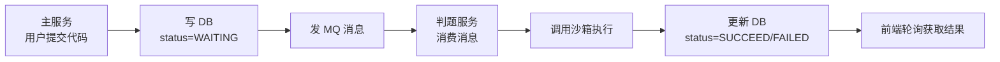

# XI OJ AIGC 项目定位与求职策略分析

更新时间：2026-04-22

---

## Q1：加上 RAG 深度优化和自定义 Agent Loop 这两处优化后，这个 Agent 模块整体水平怎么样？

加上这两个优化后，Agent 模块在校招和初级社招的维度上已经很能打了。

**RAG 这条线会成为最大的亮点。** 大多数同级别项目的 RAG 就是"调 Embedding → 查向量库 → 塞 Prompt"，到此为止。XI OJ 做到了 Query Rewrite + Cross-Encoder Rerank + 离线评估量化，这是一条完整的检索优化链路，而且有 Recall@K 数据支撑。面试时能讲出"优化前 0.6x，优化后 0.8x"，这比绝大多数候选人强。

**自定义 Agent Loop 解决了"会用框架 vs 理解原理"的问题。** 自己写推理循环、工具重试、步数限制、决策日志，说明真正理解 Agent 是怎么工作的，而不只是调了 LangChain4j 的 API。灰度切换的设计也体现了工程化思维。

**但也要清醒认识到天花板在哪：**

- 对标大厂 Agent 岗或专门做 AI Infra 的团队，项目复杂度还是偏低。工具只有 3 个且都是单步 CRUD，没有工具链编排（A 的输出喂给 B）、没有并行工具调用、没有多 Agent 协作。不过这些对校招和一般后端+AI 方向来说不是硬伤。
- RAG 的知识库规模小（几十条知识块），面试官可能会追问"数据量大了怎么办"。可以提前准备好回答：分片索引、增量同步替代全量重建、Rerank 的延迟在大候选集下怎么控制。
- 整个系统是单体架构，没有涉及 Agent 的分布式调度、长时任务管理这些话题。

**总结：** 投后端开发（有 AI 加分项）绰绰有余，投 Agent 方向的初级岗位够用，投专门的 AI 平台/Infra 岗会偏薄。

---

## Q2：对于大部分公司的实习 Agent 应用开发岗位，单看 OJ 这一个项目怎么样？

单看 OJ 这一个项目投 Agent 应用开发实习有点悬，但不是没机会。

**能过简历关的概率大概 60~70%。** 因为确实有 Agent 相关的关键词：Tool Calling、ReAct、RAG、记忆持久化、自定义推理循环。HR 和初筛不会卡。

**但面试深聊时会暴露几个短板：**

1. **Agent 不是项目的主角。** 项目本质是一个 OJ 系统，Agent 是其中一个功能模块。面试官会觉得重心在后端工程而不是 Agent 本身。Agent 应用开发岗更想看到的是"Agent 就是整个项目的核心"。
2. **工具调用场景太简单。** 3 个工具都是单步查询，没有工具链编排、没有动态工具选择、没有工具结果校验。面试官会追问"如果有 20 个工具怎么管理"、"工具之间有依赖关系怎么编排"。
3. **缺少 Agent 领域的核心话题。** 比如 Prompt 工程的系统性实践、多轮对话中的上下文压缩策略、Agent 评估体系（不只是 RAG 评估，还有端到端的任务完成率评估）、安全防护（Prompt 注入防御、工具调用权限控制）。

**结论：**

- 投"后端开发（有 AI/Agent 加分）"的岗位 → 很够用，工程化能力是亮点。
- 投"Agent 应用开发"的专门岗位 → 能过简历关，面试时需要靠对概念的理解和表达来补项目深度的不足。
- 如果 CyberClaw 也做完了一起放上去 → 投 Agent 岗就稳了，两个项目互补。

---

## Q3：投 Agent 岗位，OJ 这个项目会不会比那些医疗客服之类的好得多？

会，而且好不少。

**OJ 场景对 Agent 能力的要求天然比客服类高。** 客服类 Agent 本质上是"意图识别 + 知识库问答 + 话术模板"，大部分情况下一轮检索就能出答案，工具调用也就是查订单、查物流这种单步操作。说白了就是一个带 RAG 的问答机器人，Agent 的"推理"和"决策"能力几乎没有体现。

OJ 场景不一样，Agent 需要真正的多步推理：

- 用户说"帮我看看第 5 题哪里错了" → Agent 要先查题目信息 → 再查错题记录 → 基于两者分析错误原因。这是一个有依赖关系的多步决策链路。
- 判题工具是有副作用的操作（创建提交记录、调用沙箱执行代码），不是简单的数据库查询。这比客服场景的"查订单"复杂度高一个级别。
- RAG 检索需要区分知识类型（算法知识 vs 错题分析 vs 代码模板），不是客服那种"所有文档扔一个库里搜就行"。

**面试官看项目时的心理活动大概是这样的：**

- 看到医疗/客服 Agent → "又一个 RAG + 问答，和网上教程差不多"
- 看到 OJ Agent → "有工具调用、有判题这种有副作用的操作、RAG 做了双库隔离和 Rerank、还自己写了推理循环，这个人确实动了脑子"

**不过有一点要注意：** 优势成立的前提是能讲清楚"为什么 OJ 场景比客服场景更能体现 Agent 能力"。如果面试官没意识到这个区别，需要主动点出来。比如：

> "我选 OJ 场景而不是客服场景，是因为 OJ 的工具调用有真实副作用（代码判题会创建沙箱执行），而且需要多步推理才能完成一次完整的错题分析，这比单轮问答更能体现 Agent 的决策能力。"

一句话就能把自己和那些客服项目拉开距离。

---

## Q4：投 Agent 岗位，最好是 OJ + CyberClaw，还是 CyberClaw + 其他一个更复杂的 Agent 项目？

OJ + CyberClaw。

**OJ 项目提供了一个 CyberClaw 给不了的东西：完整的后端工程能力证明。**

CyberClaw 是一个 Python CLI 工具，再配一个"更复杂的 Agent 项目"，大概率还是 Python + Agent。这样简历上就是两个 Python Agent 项目，面试官会觉得只会写 Agent 脚本，不会做工程。

而 Agent 岗的实际工作不是只写 Agent 逻辑。入职后大概率要做的事情：写 API 接口、对接数据库、做缓存、做限流、做监控、处理并发。这些能力 OJ 项目全覆盖了，纯 Agent 项目覆盖不了。

**面试官看到两种简历的反应：**

- OJ（Java/Spring Boot）+ CyberClaw（Python/Agent）→ "这人既能做后端工程，又理解 Agent 机制，上手快，能干活"
- CyberClaw + 另一个 Agent 项目 → "Agent 理解得不错，但能不能写业务代码？能不能接手现有系统？"

实习招人最看重的就是"能不能快速上手干活"。技术栈多样性 + 工程落地能力，比 Agent 深度更重要。Agent 深度用 CyberClaw 一个项目就够证明了，不需要两个来说同一件事。

---

## Q5：只要两个项目的话，OJ + CyberClaw 够了吗？

够了，而且搭配得挺好。

**两个项目刚好互补。** OJ 项目是 Java/Spring Boot 后端工程化 + AI 能力集成，证明能在一个完整业务系统里把 Agent 落地。CyberClaw 是 Python + Agent 核心机制（状态机、工具调用、记忆），证明理解 Agent 本身是怎么工作的。一个偏"AI 在业务中的工程化落地"，一个偏"Agent 系统本身的设计与实现"，面试官看到的是两个维度的能力而不是重复。

**对实习来说这个深度已经超出预期了。** 大部分找实习的学生能拿出一个完整项目就不错了，这里有两个，而且都不是纯 Demo：

- OJ 项目有双层缓存、AOP 守门、分层限流、RAG 量化评估这些工程细节。
- CyberClaw 有状态机编排、安全机制、CI 测试、benchmark 量化。

**两个项目的能力覆盖矩阵：**

| 考察维度 | OJ 项目覆盖 | CyberClaw 覆盖 |
|---|---|---|
| Agent 核心机制（状态机/推理循环） | 自定义 Agent Loop | 状态机编排（核心） |
| 工具调用 | 3 个业务工具 + 重试容错 | 工具白名单 + 权限分级 |
| RAG / 检索 | 双向量库 + Rerank + 量化评估 | — |
| 记忆 | Redis + MySQL 双层持久化 | 短期摘要 + 长期记忆 |
| 安全 | Prompt 乱码防护、source 隔离 | 参数校验、权限控制 |
| 工程化 | Spring Boot 全套 | CI + 单测 + benchmark |
| 可量化 | Recall@K / MRR | 成功率 / 延迟 |

再加一个项目大概率是在重复覆盖上面某几行，边际收益很低。

**把精力花在这两件事上更值：** 一是把 CyberClaw 的 benchmark 做扎实，有"优化前 vs 优化后"的数据。二是准备面试话术，每个项目能用 3 分钟讲清楚"做了什么、为什么这么做、效果怎么样"。这两件事对拿 offer 的帮助远大于再堆一个项目。

---

## Q6：OJ 项目是否需要拆成微服务？

**纯投 Agent 岗：不需要拆。** 实习项目拆微服务是减分项而不是加分项。面试官看到一个实习生的项目搞了微服务，第一反应不是"这人厉害"，而是"为什么要拆？数据量多大？QPS 多少？有几个人开发？"答不上来反而暴露"为了技术而技术"。

微服务解决的是组织和规模问题 — 多团队并行开发、独立部署、独立扩缩容。一个人开发的实习项目，这些问题都不存在。

当前的单体分层已经很清晰：Controller → AOP 守门 → Service 编排 → Agent/RAG/Memory 基础能力 → MySQL/Redis/Milvus。面试官问"如果要拆微服务你怎么拆"，能答出来就行，不需要真的拆。

---

## Q7：如果做两手准备（同时投后端岗），是否拆了更好？

后端岗的话情况不一样。微服务是后端面试的高频话题，有实际拆过的经验比纯背八股强。

**但不建议全拆，建议只拆一刀：把判题服务独立出去。**

推荐的架构：

```
xi-oj-backend（主服务）
  ├── 用户模块（留在主服务）
  ├── AI 模块（留在主服务）
  └── 题目模块（留在主服务）

xi-oj-judge-service（判题微服务）
  └── 接收判题请求，调用沙箱，回写结果

xi-oj-sandbox（沙箱，已有独立项目）

xi-oj-common（公共模块）
  └── DTO、Feign 接口、公共枚举
```

为什么只拆判题服务：
1. 代码里 `AiJudgeServiceImpl` 已经留了注释 `// 单体阶段：直接注入；微服务阶段：换成 Feign Client`，说明这个拆分点是业务驱动的。
2. 判题是 CPU 密集型（沙箱执行代码），主服务是 IO 密集型（数据库/Redis/模型 API 调用），混在一起会互相影响。这是一个合理的、有业务依据的拆分理由。
3. 只拆一个服务，工作量可控（2~3 天），但能覆盖后端面试核心考点：服务拆分依据、Feign 远程调用、Nacos 服务注册发现、接口幂等性。

为什么不拆更多：
- AI 问答、代码分析、题目解析、错题分析共享 `AiAgentFactory`、`OJKnowledgeRetriever`、`AiConfigService`，强耦合。硬拆会引入大量重复代码。
- 用户模块就是几张表 + 登录鉴权，QPS 不高、逻辑不复杂，没有独立扩缩容的需求。面试官会直接问"你一个人开发为什么要拆用户服务"。
- 拆太多服务本地开发要同时起 Nacos + 多个服务 + Milvus + Redis + MySQL，调试痛苦。

---

## Q8：是否引入 MQ？怎么引入？

**只在一个地方引入 MQ：用户提交判题这个环节。** 主服务发送判题消息到 RabbitMQ，判题服务消费消息后异步执行判题并回写数据库。



为什么这里适合用 MQ（面试话术）：

> "判题是耗时的 CPU 密集操作，用 MQ 做异步解耦有三个好处：一是削峰，高并发提交时判题服务不会被打垮；二是持久化，判题服务重启后消息不丢；三是重试，沙箱执行超时可以自动重新投递。其他模块之间是 Feign 同步调用，因为调用链路短、对实时性要求高，没必要引入 MQ 增加复杂度。"

**关键细节：AI 判题（`source=ai_tool`）不走 MQ。** AI 工具调用需要同步拿到判题结果才能继续推理，走 MQ 异步就没法在同一轮对话里返回结果。保持 `AiJudgeServiceImpl` 直接同步调用判题服务的 Feign 接口。面试加分话术：

> "普通用户提交走 MQ 异步解耦，AI 工具调用走 Feign 同步，因为 Agent 推理循环需要立即拿到判题结果才能进行下一步决策。两条链路按业务需求选择不同的通信方式。"

---

## Q9：MQ 消费者的实现要点

采用 RabbitMQ 手动确认（Manual ACK）模式，关键设计点：

**1. 异常处理：失败标记状态而不是无限重试**

判题失败时不要 `basicNack(requeue=true)`，因为如果是代码本身的问题（编译错误等），重新入队会无限循环。正确做法是 catch 异常后标记为失败状态，然后正常 ack：

```java
try {
    judgeService.doJudge(questionSubmitId);
    channel.basicAck(deliveryTag, false);
} catch (Exception e) {
    log.error("[Judge Consumer] failed questionSubmitId={}", questionSubmitId, e);
    judgeService.markFailed(questionSubmitId, e.getMessage());
    channel.basicAck(deliveryTag, false);  // 处理过了就 ack
}
```

**2. 消息体传 JSON 而不是纯 ID**

减少消费端跨服务查询，同时可以做 `source=ai_tool` 的防御性过滤：

```json
{
  "questionSubmitId": 123456,
  "questionId": 5,
  "userId": 789,
  "source": null
}
```

**3. 配合死信队列兜底**

给 `code_queue` 绑定死信交换机，系统级异常（反序列化失败等）的消息转到死信队列，运维可以排查后手动重新投递。

**4. 结果通知方式：前端轮询**

MQ 消费者解决的是"判题服务怎么拿到任务"，不是"前端怎么知道判完了"。前端提交后拿着 `submissionId` 每隔 2~3 秒轮询判题状态即可。面试话术：

> "选轮询而不是 WebSocket 是因为判题通常几秒内完成，轮询的延迟可接受，而且实现简单、不需要维护长连接状态。如果后续判题量大、需要实时推送，可以加 WebSocket 通知。"
